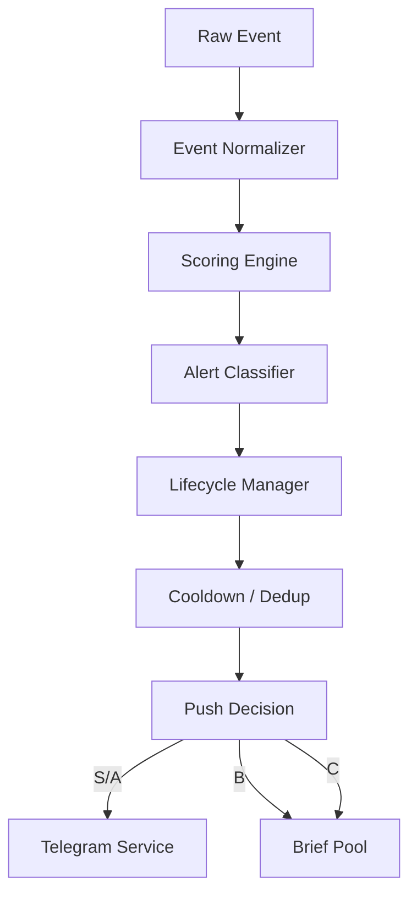

# Fiona Alert Flow

版本：V1.1.0  
状态：Planned  
负责人：Wilson  
更新时间：2026-06-26

## 流程图

```mermaid
flowchart TD
    Event["Raw Event"]
    Normalize["Event Normalizer"]
    Score["Scoring Engine"]
    Classify["Alert Classifier"]
    Lifecycle["Lifecycle Manager"]
    Dedup["Cooldown / Dedup"]
    Decision["Push Decision"]
    Telegram["Telegram Service"]
    Pool["Brief Pool"]

    Event --> Normalize
    Normalize --> Score
    Score --> Classify
    Classify --> Lifecycle
    Lifecycle --> Dedup
    Dedup --> Decision
    Decision -->|S/A| Telegram
    Decision -->|B| Pool
    Decision -->|C| Pool
```

## 生命周期

- NEW：首次出现，可推送。
- ONGOING：事件延续，默认不重复推送。
- RESOLVED：事件结束或反转，可推送总结。
