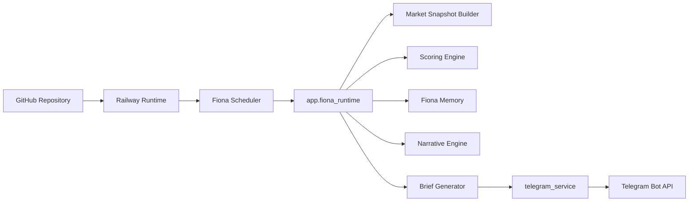

# Fiona Technical Architecture

版本：V1.0.0  
状态：Active  
负责人：Wilson  
更新时间：2026-06-26

## 1. 架构目标

Fiona Production V1 以 Railway 为运行环境，以 Telegram 为输出渠道，以 Markdown 文档为产品知识库。

## 2. 当前架构

## 3. 核心模块

- `app/fiona_runtime.py`：生产入口与 scheduler。
- `app/fiona_briefing.py`：内容生成。
- `app/fiona_engine.py`：Alert 处理。
- `app/fiona_scoring.py`：评分系统。
- `app/fiona_memory.py`：记忆系统。
- `app/fiona_narrative.py`：叙事系统。
- `app/telegram_service.py`：Telegram 统一发送服务。
- `app/wilson.py`：当前市场快照构建器。

## 4. 当前技术债

- `app/wilson.py` 仍承载快照构建与部分 legacy 工具。
- 旧金融日报模块仍在仓库中，但不在 Production Runtime 主链路。
- 数据库尚未启用，Memory 当前以文件形式保存。

## 5. 下一步架构方向

- 拆分 Market Snapshot Builder。
- 引入持久化数据库。
- 将 Alert Runtime 与 Scheduled Brief Runtime 进一步隔离。
- 建立 Dashboard/API 层。
