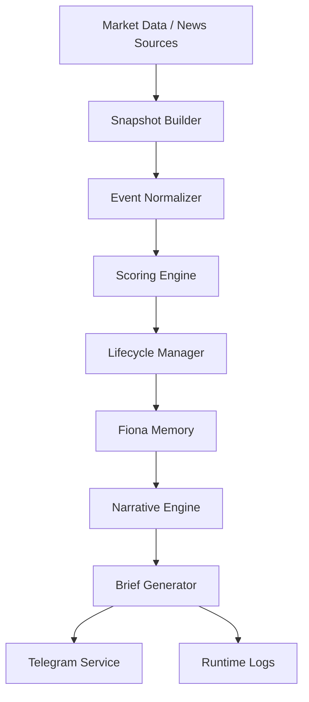

# Fiona Dataflow

版本：V1.0.0  
状态：Active  
负责人：Wilson  
更新时间：2026-06-26

## 1. 数据流

## 2. 输出

- `fiona_telegram.md`
- `fiona_status.json`
- `fiona_events.json`
- `fiona_narratives.json`
- Telegram message

## 3. 数据质量原则

- 缺失数据不重复输出“暂无数据”。
- 低价值事件进入简报池，不实时推送。
- 高价值事件必须回答为什么重要与下一步观察点。
