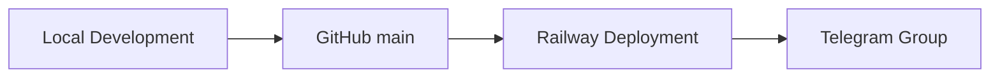

# Fiona Deployment Architecture

版本：V1.0.0  
状态：Active  
负责人：Wilson  
更新时间：2026-06-26

## 1. 当前部署



## 2. Railway

部署文件：

```text
railway.toml
```

启动命令：

```bash
python3 -m app.fiona_runtime --send run-scheduler
```

## 3. GitHub

`main` 分支是生产分支。

每次提交前必须完成 Documentation Sync。

## 4. Telegram

生产推荐推送到 Group：

```env
TELEGRAM_GROUP_ID=
```
