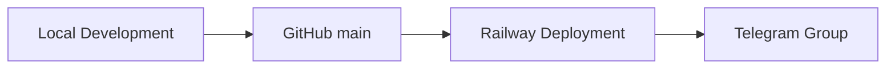

# Fiona Deployment Architecture

版本：V1.0.0  
状态：Active  
负责人：Wilson  
更新时间：2026-06-26

## 1. 当前部署


```mermaid
flowchart LR
    Local["Local Development"]
    GitHub["GitHub main"]
    Railway["Railway Deployment"]
    Telegram["Telegram Group"]

    Local --> GitHub
GitHub --> Railway
Railway --> Telegram
```

## 1.1 本地 Workspace

Fiona 本地开发仓库位置：

```text
~/Documents/Wilson AI Lab/Fiona Intelligence Platform/03_Development/fiona-intelligence-system/
```

本地数据、历史 reports 和旧 runtime 归档位置：

```text
~/Documents/Wilson AI Lab/Fiona Intelligence Platform/04_Data/
~/Documents/Wilson AI Lab/Fiona Intelligence Platform/Archive/
```

## 2. Railway

部署文件：

```text
railway.toml
```

启动命令：

```bash
python3 -m app.fiona_runtime --send run-scheduler
```

## 3. GitHub

`main` 分支是生产分支。

每次提交前必须完成 Documentation Sync。

## 4. Telegram

生产推荐推送到 Group：

```env
TELEGRAM_GROUP_ID=
```
