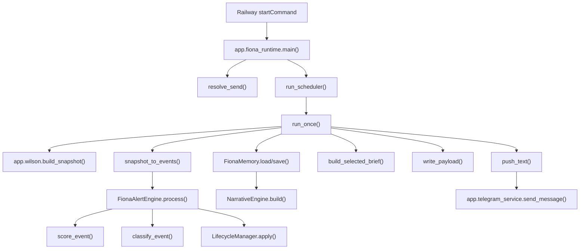
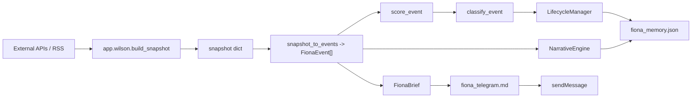
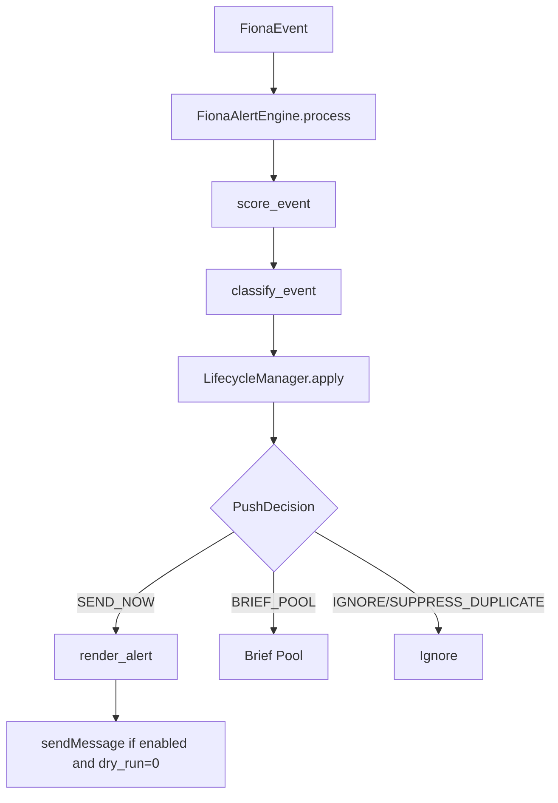

# Fiona V2 Technical Feasibility Audit

版本：V1.0  
状态：Read-only Technical Audit  
负责人：Wilson / Codex  
审计日期：2026-07-04  
审计仓库：`/Users/mac/Desktop/Wilson AI Lab/Fiona Intelligence Platform/03_Development/fiona-intelligence-system`

## 1. Executive Summary

Fiona V2 可以在当前 Fiona Production V1 架构上渐进升级，不建议重写。

当前代码已经具备 V2 的若干雏形：

- `FionaEvent` 统一事件对象基础。
- Alert scoring / classifier / lifecycle / cooldown / dedupe 基础。
- Narrative Engine 基础。
- JSON file memory 基础。
- Telegram text 与 document 发送基础。
- 1080 x 1350 PNG 三页拆图能力。
- Railway runtime 与 5 个固定简报入口。

但 V2 的核心缺口也很明确：

- 没有 Governance Layer。
- 没有 Confirmed Fact Protocol。
- 没有 source verification / source_count / source type。
- 没有 Epistemic Separation。
- 9D scoring 中只有部分维度可启发式计算，缺乏数据支持。
- Routing 仍是 brief selector + push decision，不是正式 multi-route engine。
- Alert 尚未区分 Information Alert 和 Market Anomaly Alert。
- Memory 目前是 Railway 文件系统上的 JSON，适合 V2.0 MVP，不适合长期知识图谱。
- 数据源对 ETF net flow、liquidation、open interest、funding、on-chain whale、official filings 等支持不足。

最终建议：

1. V2.0 做最小可行基础层：Event Object extension、Governance stub、9D score schema、Routing V1、Tag V1、Memory history JSON。
2. V2.1 再做 Information Alert / Market Anomaly Alert / Narrative Challenge / source verification 强化。
3. V2.2 再做 Knowledge Graph、database、Academy、Deep Research、Recommendation。

## 2. Current Production Baseline

### Repository Identity

Identity Gate 结果：通过。

```text
pwd:
/Users/mac/Desktop/Wilson AI Lab/Fiona Intelligence Platform/03_Development/fiona-intelligence-system

git root:
/Users/mac/Desktop/Wilson AI Lab/Fiona Intelligence Platform/03_Development/fiona-intelligence-system

origin:
https://github.com/wilsonchin-gif/fiona-intelligence-system.git

branch:
main

HEAD:
2295e01b8918efca5f1b9250ae3d40e96c85d2dd

origin/main:
32c5a31fb81f490304231e402a30d0104e0fa559

remote main:
32c5a31fb81f490304231e402a30d0104e0fa559

ahead / behind:
0 behind, 1 ahead
```

Archive 中存在历史备份 Git 仓库：

```text
/Users/mac/Desktop/Wilson AI Lab/Archive/Backups/2026-06-26/fiona-intelligence-system_pre_migration_133632
```

该备份仓库：

- origin 相同。
- HEAD = `32c5a31`。
- 位于 `Archive/Backups`。
- 不在 `Fiona Intelligence Platform/03_Development`。
- 本次不作为生产候选仓库。

### Railway Entry

`railway.toml`

```toml
[deploy]
startCommand = "python3 -m app.fiona_runtime --send run-scheduler"
restartPolicyType = "ON_FAILURE"
```

`runtime.txt`

```text
python-3.11.9
```

`requirements.txt`

```text
# Fiona Production V1 currently uses Python standard library only for the Railway runtime.
```

### Runtime Evidence

Production runtime:

- File: `app/fiona_runtime.py`
- Entry: `main()`
- Scheduler: `run_scheduler()`
- One-cycle generation: `run_once()`
- Payload builder: `build_payload()`
- Snapshot source: `app.wilson.build_snapshot()`
- Telegram text sender: `app.telegram_service.send_message`
- Alert engine: `FionaAlertEngine`

Key functions:

```text
app.fiona_runtime.main
-> resolve_send
-> run_scheduler / run_once

app.fiona_runtime.run_scheduler
-> run_once(brief="auto")
-> sleep(interval_minutes * 60)

app.fiona_runtime.run_once
-> build_snapshot
-> build_payload
-> write_payload
-> push_alerts if send and should_push_alerts
-> push_text if send and brief exists
```

### Schedule Contract

Source of truth:

- File: `app/fiona_briefing.py`
- Object: `BRIEF_SCHEDULES`

Current schedules:

| Brief | Code Enum | Time |
|---|---|---:|
| Fiona Market News | `FionaBriefKind.MARKET_NEWS` | 00:00 |
| Fiona Morning | `FionaBriefKind.MORNING` | 07:30 |
| Fiona Evening | `FionaBriefKind.EVENING` | 20:30 |
| Fiona Daily | `FionaBriefKind.DAILY` | 22:30 |
| Fiona Weekly | `FionaBriefKind.WEEKLY` | Sunday 21:00 |

Evidence:

```python
BRIEF_SCHEDULES = {
    FionaBriefKind.MORNING: time(7, 30),
    FionaBriefKind.EVENING: time(20, 30),
    FionaBriefKind.MARKET_NEWS: time(0, 0),
    FionaBriefKind.DAILY: time(22, 30),
    FionaBriefKind.WEEKLY: time(21, 0),
}
```

`due_brief_kinds()` uses a 15-minute tolerance and weekly only on ISO weekday 7.

### Alert Switch

Alert is not a fixed schedule. It is controlled by env:

- `FIONA_ALERT_ENABLED`, default `0`
- `FIONA_ALERT_DRY_RUN`, default `1`

Evidence:

- `app/fiona_runtime.alert_enabled()`
- `app/fiona_runtime.alert_dry_run()`
- `app/fiona_alert_runtime.alert_enabled()`
- `app/fiona_alert_runtime.alert_dry_run()`

Production default: closed unless env explicitly enables.

Important risk:

`app.fiona_runtime.should_push_alerts()` returns true for any brief when alert is enabled and dry-run is false:

```python
return bool(str(brief).strip().lower().replace("-", "_") == "alert" or alert_enabled())
```

This is safe while `FIONA_ALERT_ENABLED=0`, but before enabling production Alert it should be reviewed. It may cause alert messages to be pushed during normal brief cycles.

## 3. Repository State

### Current Git Status Before Report

```text
## main...origin/main [ahead 1]
?? docs/PRODUCT_STATUS.md
?? docs/RELEASE_HISTORY.md
?? docs/ROADMAP.md
?? docs/SYSTEM_ARCHITECTURE.md
?? docs/VERSION_MATRIX.md
?? docs/decision/README.md
?? docs/fiona_project_memo.docx
?? docs/release/README.md
```

Interpretation:

- Local branch has one unpushed commit: `2295e01`.
- Working tree already had untracked docs before this audit.
- This audit adds only `docs/audits/FIONA_V2_TECHNICAL_FEASIBILITY_AUDIT.md`.

## 4. Production Call Graph



## 5. Module Dependency Map

```text
fiona_runtime
  -> fiona_briefing
  -> fiona_classifier
  -> fiona_engine
  -> fiona_lifecycle
  -> fiona_memory
  -> fiona_narrative
  -> fiona_types
  -> telegram_service
  -> wilson

fiona_engine
  -> fiona_scoring
  -> fiona_classifier
  -> fiona_lifecycle

fiona_memory
  -> fiona_narrative
  -> fiona_types

fiona_alert_runtime
  -> fiona_engine
  -> fiona_memory
  -> telegram_service
  -> wilson append_telegram_log / telegram_message_id

wilson
  -> telegram_service
  -> external market APIs
  -> SVG/PNG renderer
```

Legacy non-production pipeline:

```text
main -> config -> fetchers -> scoring -> analysis -> render
readable_preview -> desktop_export -> market_universe
```

These are not Railway production entrypoints but remain in the repo.

## 6. Data Flow



## 7. Event Flow

```text
snapshot
-> us_event / china_event / btc_event / eth_event / rwa_event
-> FionaEvent dataclass
-> score_event
-> classify_event
-> lifecycle.apply
-> push_decision
-> brief pool and/or alert message
```

Event creation is currently hard-coded to five synthetic market events per snapshot.

## 8. Telegram Flow

Current Fiona production text flow:

```text
Fiona Runtime
-> push_text()
-> split_message()
-> app.telegram_service.send_message()
-> Telegram Bot API sendMessage
-> append_telegram_log()
```

Wilson image/document flow exists but is not the Fiona scheduler default:

```text
app.wilson.run_once(send=True)
-> render_svg_pages()
-> convert_svg_to_png()
-> push_to_telegram()
-> app.telegram_service.send_document()
-> app.telegram_service.send_message()
```

Telegram target priority:

1. `TELEGRAM_GROUP_ID`
2. `TELEGRAM_CHAT_ID`
3. `TELEGRAM_CHANNEL_ID`

Evidence:

- `app.telegram_service.telegram_config()`

## 9. Alert Flow



## 10. Memory Flow

```text
FionaMemory.load(memory_path)
-> event_memory: dict[event_family_id, EventMemoryRecord]
-> narrative_memory: dict[narrative_id, NarrativeRecord]
-> decision_memory: list[DecisionMemoryRecord]
-> FionaMemory.save(memory_path)
```

Storage:

- JSON file.
- Default path: `reports/fiona/fiona_memory.json`.
- No database persistence.

## 11. Narrative Flow

```text
events
-> NarrativeEngine.infer_narratives()
-> NARRATIVE_LIBRARY keyword/explicit mapping
-> group events by narrative_id
-> compute_narrative_score()
-> classify_narrative()
-> NarrativeRecord
-> memory.narrative_memory
```

Current statuses:

- Current Narrative
- Emerging Narrative
- Watchlist Narrative
- Fading Narrative
- False Narrative

## 12. Event Schema Gap

### Current Event Object

File: `app/fiona_types.py`  
Type: `@dataclass FionaEvent`

Current fields:

```text
event_id
created_at
source
category
title
what_happened
why_important
affected_assets
watch_next
fiona_view
raw_data
impact_score
urgency_score
confidence_score
intelligence_score
conviction_score
market_direction
level
lifecycle_status
push_decision
event_family_id
dedupe_key
cooldown_minutes
evidence
intelligence_components
```

### Current Schema vs V2 Target Schema

| V2 Field | Current Status | Current Field / Location | Gap |
|---|---|---|---|
| `event_id` | Exists | `FionaEvent.event_id` | OK |
| `title` | Exists | `FionaEvent.title` | OK |
| `event_type` | Partial | `category: EventCategory` | Rename/alias needed |
| `detected_at` | Missing | none | Add |
| `occurred_at` | Partial | `created_at` | Separate actual occurrence time |
| `verification_status` | Missing | none | Add enum |
| `sources` | Partial | `source: str`, `evidence: list[str]` | Need structured sources |
| `source_count` | Partial | `NarrativeRecord.source_count` only | Add to event |
| `entities` | Missing | none | Add structured entities |
| `assets` | Partial | `affected_assets` | Rename/canonicalize |
| `markets` | Missing | inferred from category/raw data | Add |
| `tags` | Missing | narrative inferred, no event tags | Add |
| `importance_score` | Partial | `intelligence_score`, `impact_score` | Define separately |
| `confidence_score` | Exists | `confidence_score` | Needs source backing |
| `urgency_score` | Exists | `urgency_score` | OK but heuristic |
| `impact_score` | Exists | `impact_score` | OK but heuristic |
| `novelty_score` | Partial | raw_data `novelty` | Promote to field |
| `persistence_score` | Partial | `NarrativeRecord.persistence_score` | Add event-level or route-level |
| `cross_market_score` | Partial | computed in narrative/scoring | Add field |
| `narrative_score` | Partial | `NarrativeRecord.narrative_score` | Add event relation |
| `risk_score` | Missing | category/risk signals only | Add field |
| `lifecycle_status` | Exists | `LifecycleStatus` | OK |
| `routes` | Missing | `push_decision`, brief selector | Add multi-route list |
| `parent_event_id` | Missing | `event_family_id` related but not parent | Add clustering parent |

### Duplicate Event Schema

There are multiple event-like schemas:

- `FionaEvent` in `app/fiona_types.py`: production Fiona event.
- `NewsItem` in `app/models.py`: legacy news item.
- Raw `dict` snapshot items in `app/wilson.py`.
- `AlertRunItem` in `app/fiona_alert_runtime.py`: alert run output.

Recommendation:

- Keep `FionaEvent` as the canonical V2 event.
- Do not replace legacy schemas immediately.
- Add backward-compatible optional fields to `FionaEvent`.
- Create adapters from `NewsItem` and Wilson snapshot dicts into `FionaEvent`.

### Production Risk of Changing Event Object

Directly changing required constructor fields will break Production V1 tests and runtime.

Recommended strategy:

- Add optional fields with defaults.
- Add new enums in `fiona_types.py`.
- Keep `category`, `affected_assets`, `created_at`, `source` for backward compatibility.
- Add aliases/mapping methods for V2 naming.
- Do not migrate existing memory file destructively.

## 13. Governance Gap

### V2 Governance Target

Confirmed Fact Protocol:

- Path 1: at least 3 independent sources.
- Path 2: 1 primary source + 1 authoritative supporting source.

Verification Status:

- Confirmed
- Probable
- Developing
- Unverified
- Conflicting
- False
- Stale
- Manipulated

Epistemic Separation:

- Fact
- Inference
- Hypothesis
- Scenario
- Opinion

Judgment Accountability:

- Public review for major high-confidence user-impacting errors.
- Internal review for low-confidence internal assumptions.

### Current Capabilities

| Capability | Current Status | Evidence |
|---|---|---|
| source_count | Partial | `NarrativeRecord.source_count`; not event-level |
| source type | Missing | `source` is a string only |
| source confidence | Missing | no source quality model |
| verification status | Missing | no enum/status |
| evidence | Partial | `FionaEvent.evidence` list[str] |
| confidence | Partial | `confidence_score`, not evidence-backed |
| fact/inference separation | Missing | content fields are prose |
| conflicting source handling | Missing | no conflict model |
| stale detection | Missing | only narrative fading by last_seen |
| false information handling | Partial | false narrative heuristic only |

### Where to Add Governance

Recommended new module:

```text
app/fiona_governance.py
```

Responsibilities:

- `VerificationStatus`
- `SourceType`
- `EpistemicType`
- `SourceEvidence`
- `verify_event_sources(event)`
- `classify_epistemic_claims(event)`
- `apply_confirmed_fact_protocol(event)`

### What Must Be Deterministic

Do not let LLM freely decide:

- Source count.
- Whether source is primary.
- Whether sources are independent.
- Timestamp freshness.
- Whether a source is stale.
- Numeric threshold triggers.
- Alert cooldown.
- Deduplication.
- Route decision thresholds.

### What Can Be Hybrid

Rules + model can help with:

- Extracting entities from prose.
- Mapping a headline to a narrative.
- Explaining why it matters.
- Detecting possible contradiction wording.
- Drafting Fiona's View after facts are verified.

### What Can Be LLM-assisted

- Natural language summarization.
- Knowledge Academy explanations.
- Related topic suggestions.
- Scenario wording.

## 14. 9D Scoring Gap

### Current Scores

Current event scores:

- `impact_score`: 1-10
- `urgency_score`: 1-10
- `confidence_score`: 1-10
- `intelligence_score`: 1-100
- `conviction_score`: 0-100

Current intelligence components:

- `impact_weight`
- `time_horizon_weight`
- `narrative_weight`
- `cross_market_weight`
- `novelty_weight`
- `decision_value_weight`
- `confidence_adjustment`
- `noise_penalty`
- `repetition_penalty`

### Hard-coded Thresholds

Examples:

- `intelligence_score >= 85` -> S.
- `intelligence_score >= 70` -> A.
- `intelligence_score >= 40` -> B.
- BTC price move >= 1.5% -> A hard trigger.
- ETH >= 3%.
- SOL >= 4%.
- BTC ETF flow > 100M -> S.
- ETH ETF flow > 50M -> S.
- Price cooldown 60 minutes.
- Institution cooldown 240 minutes.
- Narrative cooldown 12 hours.

### V2 9D Readiness Matrix

| Score | Technically Computable | Data-supported | Current Feasibility | Notes |
|---|---|---|---|---|
| Importance | Yes | Partial | Heuristic only | Can map from intelligence/impact, but no verified source basis. |
| Confidence | Yes | Partial | Heuristic only | Current confidence is manually assigned in event builders. |
| Urgency | Yes | Partial | Heuristic only | Based on price thresholds/category. |
| Impact | Yes | Partial | Heuristic only | Heatmap/price based; lacks cross-source validation. |
| Novelty | Yes | Weak | Heuristic only | Stored in raw_data; no historical novelty engine. |
| Persistence | Yes | Partial | Narrative-level only | Uses days seen in current event batch, not durable history. |
| Cross-Market | Yes | Partial | Heuristic only | Uses asset/category count; no causal confirmation. |
| Narrative | Yes | Partial | Heuristic only | Library + keywords + event batch. |
| Risk | Not explicit | Weak | Needs new field | Risk inferred via category/signals only. |

Important principle:

Code can compute a number. That does not mean the data supports that score.

Current scoring is useful for product behavior, but not yet sufficient for high-confidence Governance Layer decisions.

### Score Inflation Risk

Risk exists because:

- Macro categories receive high `time_horizon_weight`.
- Event builders seed `narrative_strength`, `novelty`, and signals manually.
- Source confidence does not constrain final score.
- `confidence_score` is not tied to evidence or source count.
- Multiple synthetic events are created every snapshot, which can make routine states appear important.

Mitigation:

- Add data-supported flags per score.
- Add score provenance.
- Add `score_quality = data_supported | heuristic | model_assisted`.
- Require verification status before S-level information alerts.

## 15. Routing Gap

### Current Routing

Current routing is not a formal routing engine.

Existing mechanisms:

- `brief` CLI selector: `auto`, `alert`, `morning`, `evening`, `market-news`, `daily`, `weekly`.
- `due_brief_kinds()` checks fixed schedules.
- `PushDecision`: `SEND_NOW`, `BRIEF_POOL`, `SUPPRESS_DUPLICATE`, `IGNORE`.
- Brief builders rank/filter events internally.

### V2 Target Routes

- Ignore
- Store Only
- Watch
- Market News
- Morning
- Evening
- Daily
- Weekly
- Alert

Future:

- Academy
- Today's Asset
- Deep Research
- Timeline Update

### Gap Answers

| Question | Answer |
|---|---|
| Current routing exists? | Partial. Alert push decision + brief selector only. |
| Explicit route or if/else? | Mostly if/else and enum selector. |
| Can same event enter multiple outputs? | Informally yes: same processed events feed brief and alert messages. No route list. |
| Watch state? | No formal Watch route. |
| Ignore / Store Only? | `IGNORE` exists; Store Only missing. |
| Alert and Brief coupled? | Yes. `build_payload` creates alert messages and brief from same processed event list. |
| Can Multi-Route be added without breaking scheduler? | Yes if routes are optional fields and existing brief builders continue to accept event lists. |
| New module or extend engine? | New `app/fiona_routing.py` recommended. |
| Minimum Routing V1 | Add `Route` enum and `routes: list[Route]` on events while preserving `PushDecision`. |

## 16. Alert V2 Gap

### Current Alert Engine

Implemented:

- Event scoring.
- S/A/B/C classification.
- Hard triggers for price, ETF, macro, institution, risk, on-chain, narrative.
- Dedup through `event_family_id`.
- Cooldown through `last_pushed_at`.
- Lifecycle: NEW / ONGOING / RESOLVED.
- Dry-run through `FIONA_ALERT_DRY_RUN`.
- Simulated event test harness.

### Current Triggers

Price:

- BTC >= 1.5%
- ETH >= 3%
- SOL >= 4%
- SPX >= 2%
- QQQ >= 2.5%
- NVDA/TSLA >= 5%
- ONDO/MKR/ENA >= 5%

ETF:

- BTC net flow > 100M.
- ETH net flow > 50M.
- streak/extreme flags.

Macro / Institution / Risk / Narrative:

- raw_data flags and thresholds.

### V2 Alert Gap Analysis

| V2 Requirement | Current Status | Gap |
|---|---|---|
| Information Alert | Partial | No separate path; source verification missing. |
| Market Anomaly Alert | Partial | Price trigger exists; no volume/liquidation/OI/funding confirmation. |
| Developing Alert | Missing | No verification status. |
| Confirmed Alert | Missing | No Confirmed Fact Protocol. |
| Cause Unknown | Missing | Alert text assumes explanation. |
| Cause Unconfirmed | Missing | No cause field/status. |
| Material Change Only | Partial | Upgrade threshold + evidence; not generalized. |
| Dedup | Exists | `event_family_id`, `dedupe_key`. |
| Cooldown | Exists | category cooldown. |
| Lifecycle Update | Exists | NEW/ONGOING/RESOLVED. |
| Multi-source market data confirmation | Missing | Single-source snapshot. |
| API error exclusion | Partial | safe_call exists in Wilson; no anomaly-quality guard. |

### Current Maximum Production Risk

The largest Alert risk is not code execution; it is false precision:

- A synthetic event can become A/S based on heuristic scores.
- A price move can trigger without multi-source confirmation.
- Cause is often inferred from template text rather than verified evidence.
- Enabling Alert production without verification could create noisy or misleading alerts.

### Before `FIONA_ALERT_ENABLED=1`

Must add:

1. Alert route separation.
2. Information vs anomaly classification.
3. Verification status.
4. Anomaly source confirmation.
5. Cause unknown/unconfirmed support.
6. Material change rule tests.
7. Telegram dry-run audit in Railway.

## 17. Memory Gap

### Current Memory

File: `app/fiona_memory.py`

Storage:

- JSON file.
- Default runtime path: `reports/fiona/fiona_memory.json`.
- Alert runtime path: `reports/fiona/alerts/fiona_alert_memory.json`.

Schema:

```text
FionaMemory
├── event_memory: dict[str, EventMemoryRecord]
├── narrative_memory: dict[str, NarrativeRecord]
└── decision_memory: list[DecisionMemoryRecord]
```

### Persistence Risk

Railway filesystem is not a durable application database.

| Scenario | Current Memory Outcome |
|---|---|
| Process restart same container | May persist if filesystem remains. |
| Railway redeploy | Risk of loss. |
| New instance / ephemeral rebuild | Risk of loss. |
| Local run | Persists in local reports path. |

### V2.0 DB Decision

V2.0 can proceed without database if scope is:

- Event history.
- Alert history.
- Route history.
- Verification history.
- Lifecycle history.

For V2.0, JSON memory is acceptable if:

- Memory loss is tolerated.
- Alerts remain conservative.
- Reports record enough context.
- No user-facing long-term search is promised.

SQLite:

- Not ideal for Railway persistent production unless attached persistent volume is configured.
- Better than JSON for schema, but still not a durable cloud database by default.

PostgreSQL:

- Not necessary for V2.0 foundation.
- Becomes necessary for V2.2 Knowledge Graph, Search, Recommendation, persistent timeline, and multi-user product.

Recommendation:

- V2.0: JSON memory with schema version and append-only audit files.
- V2.1: consider SQLite only for local/dev analytics.
- V2.2: introduce PostgreSQL when Knowledge Graph and Search enter production.

## 18. Tag System Gap

### Current Tag Support

Current:

- `NarrativeEngine` has `NARRATIVE_LIBRARY`.
- `NarrativeDefinition` has assets and keywords.
- `NewsItem.tags` exists in legacy model.
- `fiona_briefing` references narratives.
- No canonical internal Tag object.
- No event-level `tags`.
- No Telegram hashtag layer.

### V2 Target Tag Types

- Market
- Narrative
- Asset
- Institution
- Person
- Concept
- Risk
- Event
- Policy
- Geography

### Gap Answers

| Question | Answer |
|---|---|
| Reusable? | Narrative library, affected_assets, categories, NewsItem tags. |
| Free-text tag pollution? | Yes risk. Narrative IDs and custom slugs are unconstrained. |
| Need controlled vocabulary? | Yes. |
| Need canonical tag id? | Yes. |
| Telegram hashtag vs internal tag? | Should be separated. Internal tag can be structured; Telegram hashtag should be curated and short. |
| V1 minimum | `FionaTag` dataclass/enum, controlled registry, event `tags`, helper to render top 3 hashtags. |

## 19. Telegram Image Gap

### Current Capability

Exists in `app/wilson.py`:

- `render_svg_pages()`
- `render_overview_page()`
- `render_us_china_page()`
- `render_crypto_rwa_page()`
- `page_svg_start()` uses `width=1080`, `height=1350`.
- `convert_svg_to_png()` uses `/usr/bin/sips`.
- `push_to_telegram()` uses `sendDocument` for PNG pages, then `sendMessage`.

Exists in `app.telegram_service.py`:

- `send_message(text)`
- `send_photo(image_path)`
- `send_document(document_path)`

### Current Limitations

- Fiona production scheduler sends text only through `app.fiona_runtime.push_text()`.
- Image renderer still uses Wilson branding and snapshot shape.
- Image and text are sent as separate Telegram messages in Wilson flow.
- `send_document()` has no caption parameter.
- `send_photo()` has no caption parameter.
- No media group support.
- No message thread/reply chaining.

### sendPhoto vs sendDocument

For Fiona Image Intelligence:

- `sendDocument` is preferred for preserving original PNG quality.
- `sendPhoto` is better for inline preview but Telegram may recompress.

### Best Same-Message Experience

Most practical V2 implementation:

1. Send PNG as document with short caption if service supports caption.
2. Caption contains Layer 1 summary and top tags.
3. If caption exceeds limit, send image/document first and text as reply or immediately following message.
4. Use stable `message_id` linking in logs.

Current code needs:

- `telegram_service.send_document(document_path, caption=None)`.
- Image brief builder separate from legacy Wilson renderer.
- Short text template for caption.
- Tag renderer.
- Failure handling preserving text fallback.

## 20. Narrative Gap

### Current Narrative Engine

Implemented:

- Narrative library with fixed definitions.
- Keyword and explicit raw_data mapping.
- Narrative score.
- Current / Emerging / Watchlist / Fading / False.
- False narrative heuristic.
- Direction and confidence.
- Sources set at narrative level.

### Gaps

| Capability | Current Status | Gap |
|---|---|---|
| Lifecycle | Partial | Status exists; no transition history. |
| Conviction | Partial | `confidence_score` exists; not evidence-backed. |
| Evidence | Partial | event_ids and sources; no source evidence. |
| Fading | Exists | based on last_seen. |
| False narrative | Exists | heuristic. |
| Price before news | Missing | no timestamped market data vs news comparison. |
| Narrative Challenge | Missing | no Popular Narrative vs Observed Evidence comparison. |
| Timeline | Partial | first_seen/last_seen only. |

V2.0 recommendation:

- Add event/narrative evidence fields and tag mapping.
- Do not implement full Narrative Challenge in V2.0.

V2.1 recommendation:

- Implement Narrative Challenge after source verification and market timestamp data exist.

## 21. Event Clustering Gap

Current foundations:

- `event_family_id`
- `dedupe_key`
- narrative grouping
- affected_assets overlap
- category enum

Missing:

- similarity scoring.
- parent_event_id.
- time-window grouping.
- tag overlap engine.
- macro cluster inference.
- embedding/vector DB.

V2.0 recommendation:

- Implement rule-based clustering only.
- Use time window + market/category/assets/tags.
- Add `parent_event_id` optional field.
- Example cluster: `macro_liquidity_repricing`.

Do not use embedding/vector DB in V2.0.

V2.1/V2.2:

- Consider embeddings only when event volume grows and source text is stored.

## 22. Data Source Inventory

### Current Sources

| Source | Type | Key Required | Current Use | Reliability | Criticality |
|---|---|---|---|---|---|
| Yahoo Finance chart API | Unofficial HTTP JSON | No | US indices, stocks, ETFs, commodities, FX, HSI | Medium; unofficial | High |
| Eastmoney push2 APIs | Unofficial HTTP JSON | No | China indices, A-share gainers/losers, boards, northbound | Medium; may change | High |
| CoinGecko markets/global/categories/exchanges | Public HTTP JSON | No in current code | Crypto prices, top100, categories, CEX proxy | Medium; rate limit risk | High |
| Binance ticker 24hr | Public HTTP JSON | No | Crypto fallback, CEX fallback | Medium-high | Medium |
| DeFiLlama protocols | Public HTTP JSON | No | RWA TVL, new protocols | Medium-high | High |
| DeFiLlama DEX overview | Public HTTP JSON | No | DEX volume | Medium-high | Medium |
| Stablecoins.llama.fi | Public HTTP JSON | No | Stablecoin supply/growth | Medium-high | High |
| Alternative.me Fear & Greed | Public HTTP JSON | No | Fear & Greed | Medium | Medium |
| Fed RSS | RSS | No | Macro policy headlines | Medium-high | Medium |
| Yahoo Finance RSS | RSS | No | US/China news proxy | Medium | Medium |
| CNBC RSS | RSS | No | US market news | Medium | Medium |
| SCMP RSS | RSS | No | China economy news | Medium | Medium |
| Cointelegraph RSS | RSS | No | Crypto news | Medium | Medium |
| Decrypt RSS | RSS | No | Crypto news | Medium | Medium |
| Google Translate unofficial endpoint | HTTP | No | headline translation | Medium; unofficial | Low |
| Wikipedia S&P/CSI pages | HTML scrape | No | legacy market_universe constituents | Low-medium | Low |

### V2 Target Data Support

| Capability | Status | Notes |
|---|---|---|
| US equities | Supported | Yahoo quote proxy; not exchange-grade. |
| China equities | Partially Supported | Eastmoney unofficial; fallback risk. |
| Crypto prices | Supported | CoinGecko + Binance fallback. |
| Crypto market cap | Supported | CoinGecko. |
| ETF flow | Mock/Fallback | Uses ETF price/volume proxy, not real net flow. |
| Stablecoin supply | Supported | Stablecoins.llama. |
| RWA TVL | Supported | DeFiLlama protocols category=RWA. |
| RWA market cap | Partially Supported | CoinGecko RWA category. |
| Volume | Partially Supported | Crypto/DEX/CEX yes; equities volume proxy. |
| Liquidation | Missing | No Coinglass/Hyblock/etc. |
| Open Interest | Missing | No futures OI source. |
| Funding Rate | Missing | No exchange funding source. |
| DXY | Supported | Yahoo symbol `DX-Y.NYB`. |
| US10Y | Missing in production list | Mentioned in events but not fetched as quote. |
| Fed | Partially Supported | Fed RSS headlines, not full calendar/transcripts. |
| Central Bank | Partially Supported | Fed only; PBOC via news only. |
| Government policy | Partially Supported | RSS/news only. |
| Regulatory filings | Missing | No SEC EDGAR/company filings integration. |
| Company announcements | Missing | No official IR/filings feed. |
| Geopolitics | Partially Supported | News RSS only. |
| On-chain flows | Missing | No wallet/chain analytics. |
| Large wallet activity | Missing | No whale source. |

Do not count fallback sample/simulated Alert data as real production support.

## 23. Testing Gap

### Current Tests

Test files: 7  
Test cases: 37  
Result during audit:

```text
Ran 37 tests in 0.029s
OK
```

Compile check:

```text
compiled 30 python files
```

### Coverage by Area

| Area | Current Coverage |
|---|---|
| Alert dry-run | Yes |
| Alert template sections | Yes |
| Forbidden term filtering | Yes |
| Price duplicate cooldown | Yes |
| Low-intelligence ignore | Yes |
| Scoring macro vs price | Yes |
| Lifecycle NEW/ONGOING/RESOLVED | Yes |
| Narrative current/false/fading | Yes |
| Memory save/load | Yes |
| Schedule contract | Yes |
| Brief templates | Yes |
| Runtime run_once no send | Yes |
| Mock Telegram send path | Yes |
| Telegram target priority | Yes |
| Legacy scoring | Minimal |

### Missing V2 Tests

Must add:

- Source verification / Confirmed Fact Protocol.
- Conflicting source handling.
- Stale source detection.
- Manipulated/false status.
- Multi-route routing.
- Store Only / Watch route.
- Material Change Only.
- Information Alert vs Market Anomaly Alert.
- Cause Unknown / Cause Unconfirmed.
- API malformed response.
- API timeout.
- Duplicate event across sources.
- Memory schema migration.
- Route history.
- Verification history.
- Telegram document caption failure.
- Image generation failure fallback.
- Sensitive Telegram error redaction.

## 24. Security and Production Risk

### Secrets

Files detected locally:

```text
.env
config/fiona.env
```

Git status:

- `.env` ignored by `.gitignore`.
- `config/fiona.env` ignored by `.gitignore`.
- `git ls-files` did not show tracked `.env` or real token files.

Risk:

- Medium local risk: secrets exist on disk.
- Low Git risk based on current tracked file scan.

### Token Leakage in Logs

Potential risk:

- `telegram_service.telegram_request()` builds URL containing bot token.
- If `urllib` exception string includes URL, `push_text()` or `push_to_telegram()` may log `str(exc)`.

Risk level: Medium.

Recommendation:

- Add Telegram error sanitizer before logging.
- Never log full Telegram URL.

### Local Absolute Paths

Detected:

- `config/fiona.env` uses Documents path while current workspace is Desktop.
- `scripts/run_fiona_once.sh` default output path points to Documents Wilson AI Lab.

Risk:

- Low for Railway if Railway env overrides output.
- Medium for local operator confusion.

No change made in this audit.

### Railway Env Dependency

Production depends on:

- `TELEGRAM_BOT_TOKEN`
- `TELEGRAM_GROUP_ID`
- `WILSON_SEND`
- `WILSON_TIMEZONE`
- `WILSON_INTERVAL_MINUTES`
- `FIONA_ALERT_ENABLED`
- `FIONA_ALERT_DRY_RUN`

### Scheduler Risk

If `WILSON_INTERVAL_MINUTES=240`, `run_scheduler()` sleeps 4 hours and `due_brief_kinds()` has only 15-minute tolerance.

If Railway process start time is not aligned to schedule windows, fixed briefs can be missed.

This is a production reliability risk but not changed in this audit.

## 25. Technical Debt

1. `app/wilson.py` is very large: 2682 lines and mixes data fetching, rendering, formatting, Telegram push, and CLI.
2. Production Fiona still depends on Wilson snapshot shape.
3. Event creation is hard-coded to five synthetic market events.
4. No formal governance module.
5. No formal routing module.
6. Multiple legacy pipelines coexist.
7. Some docs/config paths reference Documents while current workspace is Desktop.
8. Alert enabling logic needs pre-production review.
9. Image Intelligence renderer exists but not integrated into Fiona runtime.
10. No durable database or persistent queue.

## 26. Implementation Readiness Matrix

| Feature | Rating | Reason |
|---|---|---|
| Governance Layer | Not Ready | No verification/source/evidence model. |
| Event Object V2 | Partially Ready | `FionaEvent` exists; needs backward-compatible extension. |
| 9D Scoring | Partially Ready | Existing heuristic components; data support weak. |
| Routing Engine | Partially Ready | PushDecision and brief selector exist; no multi-route. |
| Information Alert | Not Ready | Needs source verification and developing/confirmed states. |
| Market Anomaly Alert | Blocked by Data | Price exists; volume/liquidation/OI/funding confirmation missing. |
| Material Change Only | Partially Ready | Upgrade threshold/evidence exists; not generalized. |
| Event Memory | Partially Ready | JSON event memory exists; persistence risk. |
| Tag System | Partially Ready | Narrative library/assets exist; no controlled tags. |
| Telegram Image Intelligence | Partially Ready | 1080x1350 PNG and sendDocument exist; not Fiona-integrated. |
| Narrative Engine V2 | Partially Ready | Current/emerging/fading/false exist; evidence weak. |
| Narrative Challenge | Not Ready | Needs source evidence and observed data comparison. |
| Event Clustering | Partially Ready | event_family_id/narratives exist; no parent/cluster engine. |
| Judgment Memory | Partially Ready | decision_memory exists; no outcome/review. |
| Public Review | Not Ready | No workflow/schema. |
| Academy | Not Ready | Product docs only; no content engine. |
| Knowledge Graph | Blocked by Architecture | Needs tags, event store, search, persistence. |

## 27. Recommended Phases

### Phase 0: Stabilize V1 Audit Baseline

Goal:

- Make current repo state explicit before V2 changes.

Scope:

- No business code.
- Confirm GitHub/Railway state.
- Decide what to do with untracked docs.

Files likely affected:

- Docs only.

Migration risk:

- Low.

Production risk:

- None if no deploy.

Test requirements:

- Existing 37 tests.
- Compile check.

Rollback:

- Remove docs-only audit changes before commit if needed.

Railway env change:

- No.

DB:

- No.

New data source:

- No.

### Phase 1: V2 Foundation Schema

Goal:

- Add backward-compatible Event Object V2 fields, Tag V1, Route V1.

Scope:

- Extend `FionaEvent` optional fields.
- Add `VerificationStatus`, `Route`, `FionaTag`.
- Add schema versioning.

Files likely affected:

- `app/fiona_types.py`
- new `app/fiona_routing.py`
- new `app/fiona_tags.py`
- tests
- docs

Migration risk:

- Medium if constructor compatibility is broken.

Production risk:

- Low if defaults preserve existing behavior.

Test requirements:

- Schema compatibility.
- Existing memory load.
- Existing briefs unchanged.

Rollback:

- Revert optional field additions.

Railway env change:

- No.

DB:

- No.

New data source:

- No.

### Phase 2: Governance + Routing MVP

Goal:

- Establish deterministic governance and route decisions.

Scope:

- `Confirmed Fact Protocol` skeleton.
- Source/evidence model.
- Verification status.
- Multi-route with current behavior preserved.

Files likely affected:

- new `app/fiona_governance.py`
- `app/fiona_runtime.py`
- `app/fiona_engine.py`
- `app/fiona_classifier.py`
- tests

Migration risk:

- Medium.

Production risk:

- Medium if routing changes are not feature-gated.

Test requirements:

- No route regression.
- No accidental Telegram send.
- Verification status tests.

Rollback:

- Feature flag new route/governance behavior.

Railway env change:

- Optional feature flag recommended.

DB:

- No.

New data source:

- No.

### Phase 3: Alert V2 Dry Run

Goal:

- Build Information Alert and Market Anomaly Alert as dry-run only.

Scope:

- Separate alert paths.
- Material Change Only.
- Cause Unknown / Cause Unconfirmed.
- Enhanced dedupe/cooldown.

Files likely affected:

- `app/fiona_alert_runtime.py`
- `app/fiona_classifier.py`
- `app/fiona_lifecycle.py`
- new alert tests

Migration risk:

- Medium.

Production risk:

- Low if `FIONA_ALERT_DRY_RUN=1`.

Test requirements:

- Simulated events.
- Duplicate/cooldown.
- Material change.
- Unknown cause.

Rollback:

- Keep Alert disabled.

Railway env change:

- No for dry run.

DB:

- No.

New data source:

- Optional, but market anomaly quality remains limited without it.

### Phase 4: Knowledge Intelligence Product Layer

Goal:

- Start Knowledge Graph / Academy / Today's Asset foundation.

Scope:

- Persistent event/tag store.
- Search-ready schema.
- Content matrix templates.

Files likely affected:

- new data modules.
- brief/content generators.
- docs/product.

Migration risk:

- High if introduced into production runtime too early.

Production risk:

- Medium-high.

Test requirements:

- Data migration.
- Search/tag consistency.
- content snapshot tests.

Rollback:

- Keep Knowledge features separate from production scheduler until stable.

Railway env change:

- Likely yes.

DB:

- PostgreSQL likely required.

New data source:

- Likely yes for filings, ETF net flow, on-chain, liquidation.

## 28. CTO Answers Q1-Q16

### Q1. Fiona V2 是否可以在当前架构上渐进升级？

Yes. Current architecture has enough seams: `FionaEvent`, scoring, lifecycle, memory, narrative, briefing, Telegram service.

### Q2. 是否需要重写？

No. Rewriting would increase risk. Refactor by adding modules around the existing runtime.

### Q3. 哪些模块应该保留？

- `app/fiona_runtime.py`
- `app/fiona_types.py`
- `app/fiona_scoring.py`
- `app/fiona_classifier.py`
- `app/fiona_lifecycle.py`
- `app/fiona_memory.py`
- `app/fiona_narrative.py`
- `app/fiona_briefing.py`
- `app/telegram_service.py`
- `app/wilson.py` as legacy data/render provider for now.

### Q4. 哪些模块应该扩展？

- `fiona_types`: optional V2 fields.
- `fiona_scoring`: 9D score schema and provenance.
- `fiona_classifier`: split alert levels from route decisions.
- `fiona_lifecycle`: material change + route history.
- `fiona_memory`: verification/route/history schema.
- `telegram_service`: document captions and safe error redaction.

### Q5. 哪些模块应该新建？

- `app/fiona_governance.py`
- `app/fiona_routing.py`
- `app/fiona_tags.py`
- `app/fiona_sources.py`
- `app/fiona_clustering.py`
- later `app/fiona_knowledge_graph.py`

### Q6. 哪些模块存在技术债？

- `app/wilson.py` is the largest debt.
- Legacy `main/config/fetchers/scoring/render` pipeline remains.
- `scripts/run_fiona_once.sh` and local env paths reference Documents.
- Alert enable logic needs review.

### Q7. V2.0 最小可行范围是什么？

- Backward-compatible Event Object V2.
- Governance status skeleton.
- Tag V1 controlled vocabulary.
- Routing V1.
- 9D score fields with provenance.
- JSON memory history.
- Telegram text + optional tags.

### Q8. 哪些功能必须推迟到 V2.1？

- Information Alert V2.
- Market Anomaly Alert V2 dry run.
- Narrative Challenge.
- Material Change Only full rules.
- Source verification stronger implementation.

### Q9. 哪些功能必须推迟到 V2.2？

- Knowledge Graph production.
- Search.
- Recommendation.
- Academy.
- Today's Asset automation.
- Deep Research automation.
- PostgreSQL-backed persistent knowledge store.

### Q10. 当前最大技术风险是什么？

Scheduler alignment and alert coupling:

- `WILSON_INTERVAL_MINUTES=240` with 15-minute due tolerance can miss scheduled briefs if process start time drifts.
- Alert push guard may push alert messages during non-alert briefs when Alert is enabled.

### Q11. 当前最大数据风险是什么？

V2 target decisions require verified multi-source data, but current data is mostly public/unofficial APIs and RSS. ETF net flow, liquidation, open interest, funding, on-chain whale, official filings are missing.

### Q12. 当前最大产品实现风险是什么？

Trying to launch Knowledge Graph / Academy / Deep Research before governance/tag/event schema is stable.

### Q13. 是否需要数据库？

Not for V2.0. Yes for V2.2 Knowledge Graph/Search/Recommendation. PostgreSQL is the likely durable choice later.

### Q14. 是否需要 LLM？

Not required for V2.0 core routing/scoring/governance. Useful later for summarization, academy explanations, entity extraction, related-topic generation.

### Q15. 哪些判断绝不能只依赖 LLM？

- Confirmed Fact status.
- Source independence.
- Market anomaly thresholds.
- Price/liquidation/OI/funding numeric triggers.
- Telegram send decision.
- Dedup/cooldown.
- Lifecycle transition.
- Public error review classification.

### Q16. 预计最安全的实施顺序是什么？

1. Freeze V1 baseline and push/clean repo state.
2. Add optional V2 schema fields.
3. Add tag and route modules without changing runtime behavior.
4. Add governance status as non-blocking metadata.
5. Add dry-run Alert V2.
6. Add image/caption integration.
7. Add persistent DB only when Knowledge Graph enters product scope.

## 29. Final Recommendation

Proceed with gradual V2 modernization.

Do not rewrite.

Do not enable production Alert V2 until:

- Governance Layer exists.
- Market anomaly source confirmation exists.
- Alert path is split into Information Alert and Market Anomaly Alert.
- Material Change Only is tested.
- Telegram failure/sensitive-log redaction is tested.

Do not introduce a database in V2.0. Use JSON memory with schema/versioning first. Plan PostgreSQL for V2.2 when Knowledge Graph/Search/Recommendation become real product features.

Most important immediate engineering decision:

Keep Production V1 stable while adding V2 structures as backward-compatible metadata. Fiona's current codebase is good enough to evolve, but not yet good enough to make high-confidence real-time claims without stronger data governance.

