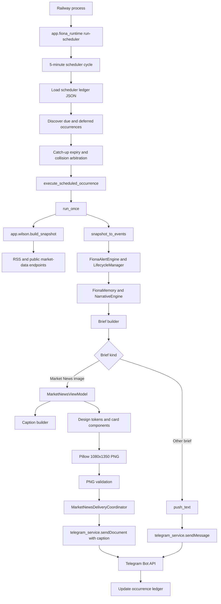

# Fiona V3.1 Global 4H Technical Audit

Version: Phase 0
Status: Gate 0 closed; implementation not started
Owner: Wilson / Codex
Audit date: 2026-08-25
Repository: `fiona-intelligence-system`

## 1. Executive Summary

Fiona V3.1 is technically feasible as a gradual extension of V3.0.0. A rewrite
is neither required nor recommended. The production renderer, delivery
coordinator, scheduler reliability layer, occurrence ledger, V2 contracts, and
Design System are reusable.

The release cannot safely be treated as a visual-only change. Four independent
production contracts are affected:

1. Telegram transport changes from document to native photo.
2. Every user-visible language surface changes to `en-US`.
3. The source and ranking model changes from a small US/China/crypto universe to
   measurable global editorial allocation.
4. The scheduler changes from five named briefs to six daily editions plus
   Weekly, with durable previous-edition state for 4H Delta.

The principal blockers are not Pillow or Telegram limits. They are source
provenance, the absence of Europe and Rest-of-World coverage, a one-time-per-kind
schedule model, and ephemeral JSON state on Railway. These blockers are
resolvable in separate reversible waves.

Audit verdict: **GATE 0 CLOSED. GO FOR PHASED DEVELOPMENT, NO BIG-BANG
CUTOVER. Gate 1 has not started.**

### 1.1 Product Review Closeout

Wilson approved the Gate 0 product boundary on 2026-08-25. The decisions are
frozen in `docs/v3_1/FIONA_V3_1_PRODUCT_FREEZE.md`, including native-photo
delivery semantics, `en-US` synthesis, dynamic 6:3:1 global coverage, six daily
4H editions, 00:00 Extended Edition semantics, no-material-change behavior,
durable 4H state, and reversible feature flags. This approval closes the audit
gate only; it does not authorize Gate 1 implementation or production changes.

## 2. Repository Gate

| Check | Result |
|---|---|
| Git root | `/Users/mac/Desktop/Wilson AI Lab/Fiona Intelligence Platform/03_Development/fiona-intelligence-system` |
| Origin | `https://github.com/wilsonchin-gif/fiona-intelligence-system.git` |
| Branch | `main` |
| Local HEAD | `a8678b0eedf37fd7567332104ece5a7a2afa3b37` |
| `origin/main` | `a8678b0eedf37fd7567332104ece5a7a2afa3b37` |
| GitHub remote `main` | `a8678b0eedf37fd7567332104ece5a7a2afa3b37` |
| Ahead / behind | `0 / 0` |
| Production release commit | `a8678b0 Release Fiona Design System 1.0` |

The worktree was dirty before this audit. Pre-existing changes were preserved:

- one modified tracked file: `docs/decisions/decision_log.md`;
- multiple untracked documentation, V3 draft, local script, and `.docx` files.

No pre-existing untracked file was staged, overwritten, moved, or deleted. This
audit creates only the four Phase 0 planning documents requested by Wilson.

## 3. V1-V3 Retrospective

### 3.1 Infrastructure Phase

V1 established:

- Python Railway runtime;
- Telegram Bot API integration;
- environment-variable compatibility;
- five fixed brief schedules;
- local report output;
- Alert Engine code with safe defaults;
- GitHub release discipline and documentation structure.

The infrastructure goal was dependable unattended delivery. Remaining V1 debt
is local-file persistence on an ephemeral Railway container and legacy helpers
inside `app/wilson.py`.

V2 hardened infrastructure with:

- five-minute polling;
- scheduled occurrence IDs;
- catch-up windows;
- retry limits;
- collision arbitration;
- partial and unknown delivery states;
- an atomic scheduler ledger write;
- safe text fallback;
- `text`, `shadow`, and `image` Market News modes;
- production validator configuration;
- V2 event, governance, score, route, alert, persistence, and tag contracts.

The infrastructure goal was to prevent missed or duplicate delivery while
introducing image output without destabilizing the scheduler. Remaining V2 debt
is that ledger durability does not survive a Railway replacement unless an
external volume is mounted.

### 3.2 Product Phase

V2.4 introduced the production 1080 x 1350 PNG card, fixed Noto Sans SC assets,
Pillow rendering, deterministic clipping, missing-data states, short caption,
and `sendDocument` delivery.

V3.0.0 introduced Design System 1.0:

- immutable visual tokens;
- reusable, independently tested components;
- judgment-first hierarchy;
- Fiona brand signature;
- Full, Missing, and Stress visual contracts;
- a release manifest, architecture snapshot, ADR, and 206-test gate.

The product goal shifted from automated report generation to a recognizable AI
market intelligence product. V3.1 now needs to improve native mobile delivery,
global evidence quality, language consistency, and temporal continuity without
undoing this foundation.

## 4. Engineering Workflow Compliance

### 4.1 Well Maintained

- Local, origin, and GitHub `main` are synchronized.
- Releases use bounded file manifests and prohibit `git add .`.
- Scheduler and delivery behavior have strong deterministic tests.
- Compile, renderer, PNG, Telegram-call, and ledger-mutation gates exist.
- Release notes, milestone history, Version Matrix, Architecture Snapshot, and
  ADR 006 exist.
- Production validator is isolated from the Railway scheduler service.
- Secrets, runtime reports, caches, and generated PNGs are ignored.

### 4.2 Incomplete or Stale

The following items were observed at audit start. Gate 0 closeout corrects the
README workspace/mode references, V3.0 GA SHA, and V3.1 Version Matrix status;
the remaining historical and untracked-document drift is deliberately left
outside this commit boundary.

- At audit start, `README.md` described the canonical workspace under
  `~/Documents`, while this production repository is under
  `~/Desktop/Wilson AI Lab`.
- At audit start, README recommended `FIONA_MARKET_NEWS_MODE=text`; the declared
  production baseline is `image`.
- At audit start, `docs/changelog/CHANGELOG.md` did not record the actual V3.0
  GA commit SHA.
- `docs/VERSION_MATRIX.md` retains stale V1 rows marked pending/planned despite
  the V3 production state.
- Several product and V3 documents remain untracked, creating documentation
  drift.
- `config/sources.json` is not the production source of truth; active RSS feeds
  are hard-coded in `app/wilson.py`.
- Point-in-time release reports list different historical test totals without a
  single current validation index.

### 4.3 Mandatory V3.1 Controls

Every wave must record:

- pre-state commit and dirty worktree;
- Previous Wave Retrospective;
- exact release boundary;
- compile, full-test, and focused-test results;
- language, source, scheduler, or visual metrics relevant to the wave;
- feature flag defaults and rollback;
- exact commit SHA after approval;
- Railway deployment source SHA and post-deploy evidence;
- CHANGELOG, Version Matrix, Release Notes, Architecture Snapshot, and ADR when
  a decision changes architecture;
- Wave Completion Review followed by a stop.

## 5. Current Production Baseline

Repository evidence identifies the production baseline as V3.0.0 GA at commit
`a8678b0`. Wilson reports Railway and Telegram image delivery as stable. The
repository production command is:

```text
python3 -m app.fiona_runtime --send run-scheduler
```

The code default for `FIONA_MARKET_NEWS_MODE` is `text`; production `image`
behavior therefore depends on the Railway variable asserted by Wilson. This
audit did not read or change Railway variables.

Current schedules in code:

| Brief | Time | Catch-up window |
|---|---:|---:|
| Market News | 00:00 daily | 60 min |
| Morning | 07:30 daily | 120 min |
| Evening | 20:30 daily | 150 min |
| Daily | 22:30 daily | 120 min, with 00:30 next-day cutoff |
| Weekly | Sunday 21:00 | 240 min |

Alert is controlled by `FIONA_ALERT_ENABLED` and
`FIONA_ALERT_DRY_RUN`, defaulting to disabled and dry-run. The Railway start
command does not run `app.fiona_alert_runtime` as a separate real-time worker.
When Alert is enabled inside `app.fiona_runtime`, candidate alerts are evaluated
during scheduled snapshot runs, not continuously.

## 6. Current Production Architecture



Key files and responsibilities:

| File | Production role |
|---|---|
| `railway.toml` | Scheduler start command |
| `app/fiona_runtime.py` | Runtime orchestration, snapshot-to-event bridge, brief selection, delivery call |
| `app/fiona_scheduler.py` | polling, occurrence discovery, ledger, retry, catch-up, arbitration |
| `app/wilson.py` | active source adapters and snapshot construction |
| `app/fiona_briefing.py` | five brief schedules and text templates |
| `app/fiona_market_news_image.py` | ViewModel, caption, missing-data logic, tags |
| `app/design_tokens.py` | 1080 x 1350 design tokens and fixed regions |
| `app/fiona_card_components.py` | independent card components |
| `app/fiona_card_renderer.py` | Pillow composition and PNG validation |
| `app/fiona_market_news_delivery.py` | text/shadow/image coordination and fallback |
| `app/telegram_service.py` | Telegram HTTP transport |
| `app/fiona_memory.py` | event, narrative, and decision JSON memory |

## 7. Telegram and iOS Audit

### 7.1 Current State

- `sendPhoto` exists but accepts only an image path; it has no caption argument.
- `sendPhoto` uses the generic request path, which does not classify timeout,
  network, malformed-response, or unknown delivery states.
- The production image path uses `sendDocumentWithCaption` semantics through
  `send_document_with_caption`.
- Document delivery has classified definite and unknown failures.
- A definite document failure falls back once to text.
- An unknown document delivery state does not retry or fall back, preventing an
  obvious duplicate.
- Success requires a Telegram `message_id`.
- The scheduler marks the occurrence running before sending and terminal after
  delivery, but this protection is only as durable as the JSON ledger.

Therefore, the existing `sendPhoto` helper is **not production-ready** for V3.1.

### 7.2 Telegram Constraints

The official [Telegram Bot API `sendPhoto` documentation](https://core.telegram.org/bots/api#sendphoto)
allows a photo of up to 10 MB, requires width plus height not to exceed 10,000,
limits aspect ratio to 20, and allows a caption up to 1,024 characters after
entity parsing. A 1440 x 1800 PNG satisfies these documented limits. The API
does not guarantee a particular iOS compression, thumbnail, or client rendering
algorithm, so device QA remains mandatory.

### 7.3 Required Transport Changes

1. Add `send_photo_with_caption` using the same multipart builder as documents.
2. Route it through classified request handling shared with document delivery.
3. Treat a returned `message_id` as the success boundary.
4. Treat network timeout, connection loss, unreadable response, and HTTP 5xx as
   unknown unless Telegram explicitly rejects the request.
5. Log only metadata: occurrence ID, payload hash, dimensions, bytes, caption
   length, message ID, and delivery classification.
6. On an unknown state, do not send a second photo, document, or text message.
7. Preserve the occurrence as terminal-unknown for manual reconciliation.

### 7.4 Recommended Fallback

Recommended automatic policy: **photo -> text on definite failure**.

Automatic photo -> document fallback is not recommended because it reintroduces
the attachment experience that V3.1 explicitly removes. It also adds another
media send after a potentially ambiguous photo attempt. Document delivery may
remain a manual rollback mode behind a feature flag.

### 7.5 iOS Safe Area

For a 1440 x 1800 canvas:

- render directly at target size;
- use a minimum 64 px outer content margin and keep critical judgment text at
  least 80 px from the image edge;
- keep the footer and disclaimer inside the same protected content frame;
- never depend on transparent padding;
- test chat-bubble preview, tap-to-open, dark mode, light mode, and text-size
  accessibility settings on representative iPhone widths;
- validate the largest `PhotoSize` returned by Telegram and capture an iOS
  screenshot before release.

## 8. 1440 x 1800 Feasibility

Result: **technically feasible and appropriate, with direct rendering**.

The target is exactly a 4/3 scale of the current 1080 x 1350 contract. The
renderer already draws text and shapes through Pillow, so no raster upscaling is
needed. Direct rendering preserves font hinting and border quality.

Required design-profile changes:

- canvas 1080 x 1350 -> 1440 x 1800;
- region coordinates, margins, spacing, radii, borders, and font sizes scale
  from one coherent token profile;
- current 42 px title becomes approximately 56 px;
- current 27 px hero text becomes approximately 36 px;
- current 17-21 px body/section text becomes approximately 23-28 px;
- image validation must use the new dimensions and a photo-safe size limit;
- renderer tests must prove no post-render resize path exists.

Resolution alone does not improve logical readability: proportional scaling
preserves the same apparent layout. The card must retain V3 judgment-first
hierarchy and pass real iOS screenshot review after Telegram processing.

Recommended shadow comparison:

1. render 1080 x 1350 and 1440 x 1800 from the same immutable ViewModel;
2. compare component bounds, truncation, file size, render duration, and OCR;
3. upload both only to an isolated validation chat, never the production group;
4. record Telegram-returned photo dimensions and file sizes;
5. conduct blinded iOS readability review before activating photo mode.

## 9. American English Audit

### 9.1 Current Surface

A static scan found Han characters in 17 application modules and 13 test files.
Nine modules on the active production path contain approximately 494
CJK-matching lines. This count includes source-recognition keywords as well as
user-facing copy, so it is a coverage indicator rather than an output-string
count.

| Surface | Current condition |
|---|---|
| Renderer labels | Mostly English, but missing/narrative/context fallbacks include Chinese |
| Caption | Section labels are English; judgment, changes, watch items, and disclaimer are Chinese |
| Morning/Evening/Daily/Weekly | Mixed English headings and predominantly Chinese body/fallback copy |
| Runtime events | `what_happened`, `why_important`, Watch Next, and Fiona's View contain Chinese |
| Alerts | Templates and simulated/production-safe messages contain Chinese |
| Narratives | At least one canonical narrative name and summaries contain Chinese |
| Source snapshot | Market names, notes, key metrics, reasons, and fallbacks contain Chinese |
| Missing data | Multiple variants of Chinese unavailable/waiting copy |
| Disclaimer | Chinese in card and most briefs; mixed English in Daily |
| Dates | ISO-like date plus hard-coded `UTC+8`; no centralized locale formatter |
| Hashtags | Mostly safe ASCII; source keyword detection is bilingual |
| Tests/fixtures | 137 CJK-matching lines encode the old language contract |

### 9.2 Translation Risk

`app/wilson.py` uses an unauthenticated Google Translate endpoint targeting
`zh-CN`, the opposite of the V3.1 output locale. It also has local English-to-
Chinese phrase substitution. RSS source text is transiently retained in each
fetch item, but the normalized snapshot often stores translated display lines
without a durable original/normalized language pair.

No current LLM is responsible for output generation. The production content is
mostly deterministic. That is positive for control, but arbitrary multilingual
headlines cannot be normalized to American English without a translation or
language-normalization service.

### 9.3 Target Localization Architecture

Create one output-language boundary rather than scattering translations:

```text
Source record
  original_text
  original_language
  source_id
        |
        v
Language normalizer
  normalized_text_en_us
  translation_status
  translation_method
        |
        v
Locale-safe ViewModel and templates
        |
        v
en-US lint and output gate
```

Recommended contracts:

- `OutputLocale.EN_US`;
- centralized static string catalog;
- centralized timestamp, number, percentage, currency, punctuation, and plural
  formatters;
- `original_text`, `original_language`, `normalized_text`, `output_locale`,
  `translation_status`, and `translation_method` on source evidence;
- deterministic CJK leakage gate for user-visible payloads;
- English-only safe fallback when normalization fails.

A model or translation service may draft normalization, but deterministic code
must enforce locale, preserve provenance, reject unresolved source text, and
prevent Chinese leakage. A prompt saying “reply in English” is insufficient.

## 10. Active Source Inventory

### 10.1 Production News Feeds

The active feed registry is the hard-coded `RSS_SOURCES` list in
`app/wilson.py`; `config/sources.json` is not consumed by the production
snapshot path.

| Source | Type / tier estimate | Region | Language | Use | Active production | Main risk |
|---|---|---|---|---|---|---|
| Federal Reserve Press | Official / Tier 1 | US | English | macro facts/context | Yes | press feed only; no calendar/data series |
| Yahoo Finance US | Aggregator / Tier 2 | US | English | market headlines | Yes | no source SLA; syndication duplication |
| CNBC Markets | Major media / Tier 2 | US | English | market context | Yes | broad feed; title-level parsing |
| Yahoo Finance China | Aggregator / Tier 2 | Greater China proxy | English | China proxy headlines | Yes | US-region feed and proxy symbols |
| SCMP China Economy | Major regional media / Tier 2 | Greater China | English | policy/economy context | Yes | paywall/feed continuity risk |
| Cointelegraph | Specialist / Tier 3 | Global/unknown | English | crypto context | Yes | editorial/noise and duplication risk |
| Decrypt | Specialist / Tier 3 | Global/unknown | English | crypto context | Yes | editorial/noise and duplication risk |

Configured but not active in the production constant: MarketWatch, Caixin
Global, and CoinDesk. Their presence in `config/sources.json` must not be counted
as production coverage.

### 10.2 Production Market/Data Endpoints

| Provider | Data | Region | Key | Fallback / risk |
|---|---|---|---|---|
| Yahoo Finance chart API | US indices, sectors, ETFs, equities, DXY, CNY, HSI, gold, silver, oil | US/Greater China/global instruments | No | failures return missing quotes; rate/SLA risk |
| Eastmoney public quote APIs | Mainland indices, movers, boards, northbound proxy | Greater China | No | empty fallback; endpoint/referer fragility |
| CoinGecko public API | crypto prices, market cap, categories, exchanges | Global crypto | No | public rate limits; partial Binance fallback |
| Binance public API | crypto ticker and spot volume fallback | Global crypto | No | exchange-specific coverage and regional access risk |
| DefiLlama APIs | protocols/RWA TVL, DEX volume, stablecoin supply | Global crypto | No | category methodology and endpoint availability |
| Alternative.me | Fear & Greed | Global crypto | No | single derived indicator; methodology dependence |
| Google Translate unofficial endpoint | display translation to Chinese | Language utility | No | no production SLA; wrong V3.1 target locale |

All current public calls use short timeouts, but RSS feeds are fetched serially
and source-specific backoff/circuit-breaker state is absent. Many failures are
converted to empty data, preserving runtime availability while reducing evidence
quality.

### 10.3 Capability Reality Check

| Capability | Status |
|---|---|
| US equities | Supported through Yahoo public data |
| Mainland equities | Partially supported through Eastmoney public data |
| Hong Kong | Partially supported; HSI quote and China-oriented media |
| Taiwan | Missing |
| Europe equities/policy | Missing |
| Rest-of-World markets | Missing except globally scoped crypto/commodities |
| Federal Reserve | Partial: press RSS only |
| ECB / BoE | Missing |
| US Treasury / BLS / BEA / Census | Missing |
| SEC / CFTC | Missing as primary sources |
| US10Y | Missing from the active quote universe despite a ViewModel slot |
| DXY / CNY | Partial public quotes |
| Commodities | Partial daily Yahoo quotes |
| ETF net flow | Missing; turnover/price is labeled as a proxy |
| Crypto spot prices/market cap | Supported with public-rate-limit risk |
| Stablecoin supply / DEX / RWA TVL | Partially supported through DefiLlama |
| Liquidations / open interest / funding | Missing |
| Institutional crypto | Headline-level specialist coverage only |
| Source independence/provenance | Missing in normalized production events |

## 11. Current Regional Distribution

Best available estimate uses the seven active production RSS feeds. This
measures source allocation, not article output or material-event share.

| Method | US & Europe | Greater China | Rest of World | Global/Unknown |
|---|---:|---:|---:|---:|
| Active feed count | 42.9% | 28.6% | 0.0% | 28.6% |
| Existing feed weights | 46.4% | 26.1% | 0.0% | 27.5% |

The US & Europe bucket currently contains US sources only. There is no active
European official or media feed and no explicit Rest-of-World source. Global
crypto providers cannot honestly be allocated to a region without event-level
geography.

## 12. Prioritized Source Expansion Map

### Tier 1: Primary and Official

Priority 1:

- ECB, Bank of England, US Treasury, BLS, BEA, SEC/EDGAR, and CFTC;
- PBOC, NBS China, CSRC, HKMA, HKEX, Taiwan central bank, and TWSE;
- Bank of Japan and Japan Ministry of Finance;
- selected official calendars with deterministic event timestamps.

Priority 2:

- Eurostat, European Commission, FCA, major European exchanges;
- Bank of Korea, RBI/SEBI, MAS, RBA, and material Middle East authorities.

### Tier 2: Top-Tier Independent Media and Data

- licensed global financial news provider(s) with clear reuse rights;
- credible exchange and market-data feeds for equities, rates, FX, commodities,
  ETF net flow, and institutional filings;
- independent corroboration for official announcements.

### Tier 3: Specialist and Contextual

- crypto/RWA specialist outlets;
- on-chain, liquidation, open-interest, funding, and ETF specialists;
- regional specialist research used as context, not sole confirmation.

Source expansion should optimize evidence quality and independence, not article
count. Licensing, rate limits, redistribution rights, timestamps, and failure
behavior require approval before adapters are implemented.

## 13. Dynamic 6:3:1 Feasibility

Result: **feasible after provenance and regional metadata are added**.

Current limitations:

- normalized events use `source="wilson_snapshot"`, losing underlying source;
- region is not a first-class event field;
- source tier and independence group do not reach the ranking path;
- current events are market summaries, not clusters of source-backed claims;
- `source_count` in the image layer mostly sees one synthetic source;
- deduplication is event-family oriented, not syndication-aware.

Minimum deterministic model:

```text
Source Registry
  source_id, tier, region, language, authority, independence_group
        |
        v
Evidence-backed Event Candidate
  event_region, markets, sources, confirmation, materiality, freshness
        |
        v
Deduplication / Clustering
        |
        v
Editorial Ranking
  materiality
  + cross-market impact
  + source quality
  + confirmation
  + freshness
  + narrative relevance
  + bounded regional-balance adjustment
  - duplicate/stale/noise penalties
        |
        v
Material override, then soft 6:3:1 allocation
```

Regional weighting must be a bounded adjustment, never a gate. A verified
material event is ranked before allocation debt. Constants must be calibrated in
Shadow using observed candidates and reviewer labels, not chosen from intuition.

Required Shadow metrics:

- 24-hour and 7-day regional share;
- candidate, selected, and published share separately;
- source diversity and source concentration;
- Tier 1 share;
- independent confirmation coverage;
- duplicate and syndication rate;
- material-event override count;
- stale-event rejection rate;
- missing-region rate;
- false-positive/false-negative reviewer labels.

Recommended calibration gate: at least 14 calendar days and at least 100
material candidate clusters before production activation.

## 14. Current Scheduler Audit

Current characteristics:

- polling default: five minutes;
- interval priority: CLI, `WILSON_INTERVAL_MINUTES`, legacy fallback;
- timezone: CLI resolves `FIONA_TIMEZONE` before `WILSON_TIMEZONE`, then
  `Asia/Manila` default;
- schedule source: one `FionaBriefSchedule` per `FionaBriefKind` in a dictionary;
- occurrence ID: brief kind plus timezone-aware scheduled timestamp;
- first start: scans only the maximum catch-up horizon;
- restart: scans from ledger `last_check_at` and applies per-kind catch-up;
- duplicate protection: terminal ledger states prevent retry;
- retry: maximum three attempts; stale running entries retry after 30 minutes;
- collision window: 180 minutes;
- collision losers are terminally suppressed, not deferred;
- ambiguous Telegram delivery is terminal-unknown and not retried;
- ledger save uses temp file plus `os.replace`;
- ledger storage is local JSON under the report output directory.

Current continuous seven-day behavior is covered by tests. The current schedule
produces 29 scheduled messages per week: 28 daily briefs plus one Weekly.

Important limitation: the dictionary schedule model cannot represent six times
for one `MARKET_NEWS` kind. V3.1 needs schedule slots/edition definitions rather
than another set of if/else checks.

## 15. Global 4H Schedule Feasibility

Result: **feasible, high migration risk**.

The target produces 43 scheduled messages per week: 42 Global 4H editions plus
Weekly. This is a 48.3% increase from the current 29 scheduled messages, despite
consolidating Morning, Evening, and Daily. The product is more continuous but
not lower-volume in absolute notifications.

Recommended schedule contract:

- `schedule_profile`: `legacy` or `global_4h`;
- `edition_type`: `standard`, `morning_context`, `evening_context`, `extended`;
- `edition_slot`: `00`, `04`, `08`, `12`, `16`, `20`;
- occurrence ID includes brief family, edition slot, scheduled timestamp, and
  schedule schema version;
- one edition builder accepts a responsibility profile rather than invoking the
  retired standalone briefs;
- a release cutoff prevents discovery of legacy Morning/Evening/Daily
  occurrences after cutover.

### Collision Findings

- Adjacent 4H slots are 240 minutes apart, outside the current 180-minute
  collision window.
- Sunday 20:00 and Weekly 21:00 are only 60 minutes apart. If both are found in
  one catch-up cycle, current priority chooses Weekly and suppresses 20:00.
- Sunday 20:00, Weekly 21:00, and Monday 00:00 can become one transitive
  collision group after downtime because each neighboring pair is within 180
  minutes. This can suppress required editions.
- Alerts are not currently part of scheduler arbitration, so Alert/edition
  collision requires a separate material-change and dedup policy.
- A 60-minute Market News catch-up window prevents stale bursts, but downtime
  longer than one hour intentionally loses an edition. The next edition must
  make the missing baseline explicit rather than silently claim a 4H Delta.

### Ledger Migration

Terminal legacy entries may remain as history. Migration should be additive:

1. introduce a schedule schema/profile version;
2. define a cutover timestamp;
3. stop discovering legacy Morning/Evening/Daily occurrences after the cutoff;
4. retain old entries read-only;
5. reuse the 00:00 Market News identity only if duplicate behavior is proven;
6. persist the profile and cutoff durably before activating the cadence flag.

No destructive ledger rewrite is recommended.

## 16. Merge Assessments

### Morning into 08:00

Feasible. The 08:00 edition should add overnight market state, the day's timed
events, and next confirmation without reproducing the old Morning template. It
must be generated from the same edition snapshot and route history.

### Evening into 20:00

Feasible. The 20:00 edition should add night-session risk, macro/ETF/crypto
conditions, and conditional scenarios. The scenario language remains
non-predictive.

### Daily into 00:00 Extended

Feasible with a reporting-date contract. The 00:00 edition needs a daily
lookback summary and next-day confirmation while remaining a 4H edition. The
system must define whether its reporting date is the just-finished local day or
the new calendar day.

### Weekly Compatibility

Weekly can remain at Sunday 21:00, but it needs an explicit exception to the
generic 180-minute collision grouping and content deduplication against Sunday
20:00. Weekly should summarize seven-day narrative and flow changes, not repeat
the preceding 4H card.

### Material Alert Compatibility

The Alert contracts, lifecycle, cooldown, and material-change classification
exist. Production does not currently run a dedicated real-time collector.
Before Alert is retained as “Material Change Only,” V3.1 must define:

- which verified change dimensions can interrupt the six-edition cadence;
- deduplication against the most recent edition;
- how an Alert updates the next 4H Delta baseline;
- durable Alert and occurrence history;
- collision behavior when an Alert appears near a scheduled edition.

## 17. 4H Delta Storage Assessment

### 17.1 Existing State Is Insufficient

- Scheduler ledger tracks delivery, not intelligence values.
- `fiona_memory.json` stores current event/narrative/decision memory but no
  ordered ViewModel history.
- report archives contain snapshots but have no durable lookup, schema, or
  Railway persistence guarantee.
- Railway container JSON is classified by the existing V2 contract as
  `EPHEMERAL`.
- `FionaMemory.save` is not atomic and grows without retention controls.

The ledger must not be expanded into a market snapshot database.

### 17.2 Options

| Option | Restart/redeploy safety | Complexity | Verdict |
|---|---|---:|---|
| Previous ViewModel file in container | No | Low | Not reliable |
| Dedicated JSON/JSONL store on mounted Railway Volume | Yes for one replica | Low/Medium | Recommended minimum |
| PostgreSQL table | Yes; multi-replica/query safe | Medium/High | Not required for initial single-replica V3.1 |
| Reuse scheduler ledger | Wrong ownership and schema | Low initially | Reject |

### 17.3 Recommended Minimum

Use one explicitly mounted Railway Volume with separate namespaces:

```text
state/
  scheduler/ledger.json
  delta/schema-v1/edition-snapshots.jsonl
  delta/schema-v1/latest.json
```

The Delta store must use atomic writes, schema versioning, checksums, scheduled
edition IDs, data timestamps, units, source IDs, quality states, and a 14-day
retention window. The comparison baseline is the immediately previous scheduled
edition, not the previous successful process invocation.

If a volume is unavailable, multi-replica deployment is planned, or concurrent
writers are introduced, PostgreSQL becomes the correct fallback. A database is
not otherwise necessary for V3.1.

Delta status must distinguish `changed`, `unchanged`, `unavailable`,
`not_comparable`, and `baseline_missing`. Rates use basis points; scores use
points; prices use percentage change from two timestamped snapshots. Missing or
stale data never becomes zero.

## 18. Feature Flag Architecture

| Flag | Legacy/default | New behavior | Safe fallback | Core observability |
|---|---|---|---|---|
| `FIONA_TELEGRAM_MEDIA_MODE` | `document` | `photo` | definite failure -> text; unknown -> no resend | requested/effective mode, message ID, failure class, image metadata |
| `FIONA_OUTPUT_LOCALE` | `zh-CN` | `en-US` | English safe fallback; never leak unresolved Chinese | locale, normalization status, leakage count |
| `FIONA_COVERAGE_PROFILE` | `legacy` | `global_631` | invalid registry/ranking -> legacy | regional shares, tiers, overrides, dedup |
| `FIONA_CADENCE_MODE` | `legacy` | `global_4h` | coordinated rollback to legacy profile | due/sent/missed/suppressed by slot |
| `FIONA_4H_DELTA_MODE` | `off` | `shadow` / `on` | baseline error -> explicit unavailable Delta | baseline ID, delta status, store health |

The fifth flag is justified because persistence and comparison need independent
Shadow validation before the cadence cutover. Resolution should be selected by
the native photo render profile, not another feature flag. Existing
`FIONA_MARKET_NEWS_MODE` remains the text/shadow/image product-generation guard
during migration.

## 19. Proposed Development Waves

### Wave 1: Native Delivery and en-US

- shared classified Telegram media request;
- `sendPhoto` with caption;
- 1440 x 1800 direct renderer profile;
- iOS safe-area and screenshot validation;
- centralized locale resources and formatting;
- output-language provenance and English leakage gate;
- no source or scheduler change.

Risk: Medium.

### Wave 2: Global Coverage Engine

- canonical source registry;
- source provenance, tier, independence, language, and region;
- source expansion in approved priority order;
- event-level geography and materiality;
- clustering/deduplication;
- dynamic 6:3:1 ranking in Shadow;
- regional observability.

Risk: High because quality depends on source licensing and data reliability.

### Wave 3: Global 4H Intelligence

- versioned six-slot schedule profile;
- edition responsibility profiles;
- Morning/Evening/Daily consolidation;
- durable scheduler state;
- dedicated Delta snapshot store;
- deterministic comparison;
- Weekly and Material Alert arbitration;
- legacy-ledger cutoff compatibility.

Risk: High.

### Wave 4: Integrated RC

- all new behavior enabled in controlled validation;
- iOS and content QA;
- geographic coverage QA;
- seven-day schedule/collision/restart simulation;
- duplicate and unknown-delivery simulation;
- storage failure and missing-baseline tests;
- production-safe renderer validation.

Risk: Medium/High.

### Wave 5: Production Rollout

- deploy code with legacy-safe defaults;
- activate and verify one reversible flag at a time;
- retain rollback evidence and stop criteria;
- observe a full seven-day cadence after schedule activation.

## 20. Risk Matrix

| Risk | Likelihood | Impact | Control |
|---|---|---|---|
| Photo timeout causes duplicate fallback | Medium | High | unknown-state terminal handling; no automatic resend |
| Telegram processing reduces iOS readability | Medium | High | direct 1440 render; staging upload; iOS screenshot gate |
| Chinese text leaks into `en-US` output | High initially | High | centralized locale boundary and deterministic leakage test |
| Translation changes meaning | Medium | High | original provenance, status, evidence review, safe withholding |
| 6:3:1 appears compliant without real sources | High | High | candidate/selected/published metrics and source-tier audit |
| Public APIs rate-limit or change | High | High | adapters, timeout, cache, circuit breaker, fallback quality state |
| ETF “flow” proxy is misread as net flow | High | High | source upgrade or explicit proxy labeling |
| Railway restart duplicates an occurrence | Medium | High | durable ledger before cadence rollout |
| Delta baseline disappears on redeploy | High today | High | mounted durable store and baseline health gate |
| Weekly/20:00/00:00 catch-up collision | Medium | High | schedule-profile-specific arbitration tests |
| Six daily messages create notification fatigue | Medium | Medium/High | compact card, no duplicate caption, no-change policy decision |
| Legacy pending occurrences send after cutover | Medium | High | profile cutoff and versioned occurrence IDs |
| Source licensing prohibits redistribution | Medium | High | legal/provider approval before adapter implementation |
| Single-volume concurrent writer corruption | Low in one replica | High | atomic writes, lock, checksum; PostgreSQL if scaling |

## 21. Dependencies

### Wave 1

- existing Pillow and bundled font assets;
- Telegram Bot API;
- approved translation/normalization mechanism for arbitrary source languages;
- physical or emulated iOS QA capability.

No new rendering dependency is required.

### Wave 2

- approved source list and redistribution/licensing decisions;
- official calendars and primary-source APIs/feeds;
- source registry and adapter contracts;
- optional credentials for paid data providers.

### Wave 3

- mounted Railway Volume or approved PostgreSQL fallback;
- cutover timestamp and schedule profile contract;
- durable state backup and restore procedure.

## 22. Required New Tests

### Native Photo and iOS

- multipart photo plus caption;
- 1,024-character caption boundary;
- 1440 x 1800 PNG size/mode validation;
- direct render with no upscale/downscale step;
- safe-area bounds and component overflow;
- definite rejection, timeout, HTTP 5xx, malformed response, missing message ID;
- no fallback after unknown delivery;
- one text fallback after definite failure;
- photo response metadata and redacted logging;
- 1080/1440 deterministic shadow comparison.

### American English

- no Han characters in any user-visible card, caption, brief, Alert, Weekly,
  fallback, missing-data, or disclaimer output;
- American spelling dictionary/lint;
- locale-safe dates, numbers, currencies, percentages, and punctuation;
- original source text preserved internally;
- translation failure never leaks non-English source text;
- static labels do not rely on a model.

### Coverage Engine

- canonical source identity and syndicated duplicate detection;
- source tier and independence;
- event region classification, including multi-region events;
- material override above regional balance;
- soft 6:3:1 allocation over 24 hours and seven days;
- no hard suppression when a region lacks candidates;
- stale, duplicate, and low-quality penalties;
- source outage and partial-evidence behavior;
- metric completeness.

### Global 4H Scheduler

- six slots for seven continuous days;
- every start/restart boundary around all six slots;
- catch-up inside/outside freshness window;
- Sunday 20:00, Weekly 21:00, Monday 00:00 collision;
- Alert near each scheduled slot;
- legacy-to-global cutover and rollback;
- no standalone Morning, Evening, or Daily in global mode;
- exact-once durable occurrence behavior across process replacement;
- old ledger read compatibility and no destructive migration.

### 4H Delta

- first edition without baseline;
- previous scheduled edition lookup;
- missing, stale, partial, unit-changed, and schema-changed values;
- bps/points/percentage calculations;
- atomic write interruption and checksum failure;
- retention and restart recovery;
- Alert update interaction;
- no scheduler-ledger mutation by Delta storage.

## 23. Required Documentation

Each approved wave must update:

- Product Freeze reference;
- wave retrospective and completion review;
- PRD and architecture/dataflow;
- source registry and evidence policy when relevant;
- Telegram/iOS specification;
- environment variable reference;
- scheduler and state migration guide;
- rollback and incident runbook;
- CHANGELOG and Version Matrix;
- release notes and release manifest;
- Architecture Snapshot;
- ADR for locale boundary, source allocation, schedule profile, or durable state;
- milestone history at GA.

## 24. Versioning Recommendation

The proposed strategy fits the existing release discipline:

| Internal milestone | Meaning |
|---|---|
| `V3.1-alpha.1` | Native Photo + `en-US` |
| `V3.1-alpha.2` | Global Coverage Engine in Shadow |
| `V3.1-beta` | six-slot scheduler and 4H Delta |
| `V3.1-RC` | integrated controlled validation |
| `V3.1.0 GA` | Fiona Global 4H Intelligence production |

Externally, V3.1 should remain one coherent product generation. Internal
milestones should be recorded in the Version Matrix without being mislabeled as
production.

## 25. Release and Rollback Strategy

No big-bang release is allowed.

Safest activation sequence:

1. deploy approved code with all new flags on legacy defaults;
2. validate 1440 rendering and `en-US` payloads without production Telegram;
3. validate native photo in an isolated Telegram chat;
4. activate `en-US` and native photo under an approved controlled cutover;
5. run global coverage in Shadow for at least 14 days;
6. activate global coverage while cadence remains legacy;
7. mount and validate durable state;
8. run Delta in Shadow;
9. simulate global cadence for seven days and rehearse cutover/rollback;
10. activate `global_4h` at a documented cutoff;
11. observe a full production week before declaring GA.

Rollback changes one flag at a time in reverse order. Cadence rollback must use
the stored cutoff/profile to prevent both legacy and global occurrences from
being discovered on the same calendar day. Unknown Telegram delivery is never
resolved by automatic resend.

## 26. Gate 0 Product Decisions Resolved

Approved on 2026-08-25:

1. Native photo uses `sendPhoto`; a definite failure falls back directly to
   text. Unknown Telegram delivery is not retried automatically.
2. Wave 1 uses original source -> normalized facts/events -> English synthesis
   -> deterministic `en-US` validation. A separate translation API requires
   demonstrated technical need and Product approval.
3. Global coverage uses a dynamic 6:3:1 editorial target: US/Europe 60%, Greater
   China 30%, Rest of World 10%, with material-event overrides.
4. Railway Volume is the minimum V3.1 durable-state medium. Snapshots are atomic,
   versioned, and retained for 14 days. PostgreSQL remains deferred.
5. Every 4H edition is produced. When no material change exists, the edition
   states that explicitly and uses reduced density without inventing a narrative.
6. The 00:00 Extended Edition belongs to the new calendar date, reviews the
   just-ended cycle/previous 24 hours, and sets Watch Next for the new cycle.
7. Sunday Weekly remains at 21:00 and requires explicit collision handling.
8. The production schedule target is 00:00, 04:00, 08:00, 12:00, 16:00, and
   20:00 in `Asia/Hong_Kong`.
9. The five rollback flags and their legacy defaults are frozen in the Product
   Freeze document.

Still requiring later gate evidence rather than a Gate 0 product decision:

- source-provider licensing and Tier 1/Tier 2 onboarding details;
- quantitative material-change and Alert-to-edition dedup thresholds.

## 27. Technical Blockers

- Existing `sendPhoto` is not equivalent to the production document transport.
- Renderer and delivery validation are fixed to 1080 x 1350 and 1.5 MB.
- User-visible language is widely mixed Chinese/English.
- Arbitrary source-language normalization has no approved production provider.
- Production source provenance collapses into `wilson_snapshot`.
- No Europe or Rest-of-World news universe exists.
- One schedule dictionary entry cannot express six edition slots.
- Existing 180-minute arbitration can suppress Sunday 20:00/Weekly/00:00
  catch-up occurrences.
- Scheduler ledger and Fiona memory are ephemeral across container replacement.
- No previous-edition ViewModel store exists.
- No official ETF net-flow, US10Y, liquidation, funding, or open-interest source
  supports several desired judgments.

## 28. Technical Debt

- `app/wilson.py` combines collection, normalization, analysis, translation,
  legacy rendering, and helper functions in one large module.
- `config/sources.json` and the active source constant diverge.
- source errors often collapse to empty data without structured quality impact;
- evidence/source counts in the card do not reflect true independent sources;
- CJK recognition keywords and user-visible CJK strings are interleaved;
- timezone precedence still favors legacy `FIONA_TIMEZONE` over documented
  `WILSON_TIMEZONE`;
- README production state and workspace path are stale;
- JSON memory is non-atomic and unbounded;
- standalone Alert runtime is not part of the Railway start command;
- current schedule tests are strong for V2 but encode five-task assumptions;
- untracked documentation indicates release-record drift.

## 29. Validation Performed

- Repository identity and remote synchronization: PASS.
- Python compile (`app` and `tests`) under Python 3.12: PASS.
- Full unit suite under Python 3.12.13 with Pillow 12.3.0: **206 tests PASS**.
- Initial system Python 3.9 run: invalid environment, missing Pillow and
  `tomllib`; not classified as a code regression.
- Telegram calls during audit: 0.
- Railway changes: 0.
- Scheduler/ledger mutations by audit commands: 0.

## 30. Final Recommendation

Gate 0 is closed. Do not start Gate 1 without an explicit Wilson instruction.
When authorized, start Gate 1 with a Previous Wave Retrospective and preserve
the current scheduler, document delivery, locale, coverage, and cadence as
defaults until each replacement has passed its own Shadow and release gate.

V3.1 should be implemented incrementally on the current architecture. Do not
rewrite Fiona, do not combine all changes in one release, and do not activate
Global 4H cadence before durable ledger and Delta state exist.
