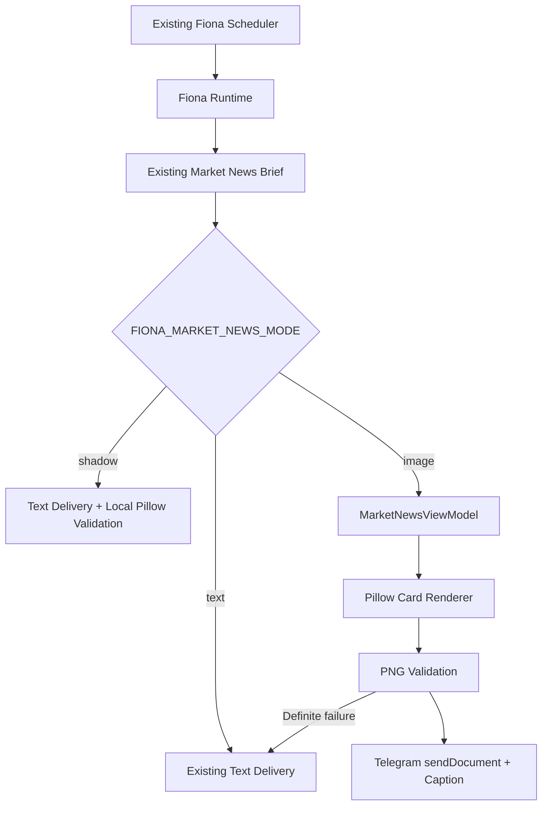

# Fiona V2 Limited Release

Status: Release Candidate
Date: 2026-07-27
Commit: Pending Wilson approval

## 1. Release Goal

Deliver Fiona Market News as a production-ready AI Market Intelligence Card
while preserving the existing text experience as the default and rollback
path.

This limited release covers Market News only. Scheduler, Ledger, Arbitration,
Morning, Evening, Daily, Weekly, and Alert behavior remain unchanged.

## 2. New Capabilities

- Fixed 1080 x 1350 PNG Market Intelligence Card.
- Railway-compatible Python Pillow rendering.
- Bundled Noto Sans SC fonts for deterministic Chinese, English, and numeric
  output.
- Market Regime and Evidence Level.
- Fiona's View, Heat Map, What Changed, Key Markets, Current Narrative,
  Watch Next, Historical Context, Tags, and Disclaimer.
- Missing-data and long-text protection without shrinking the defined
  typography.
- Telegram document delivery with a compact caption.
- Definite image-path failures fall back to the existing Market News text.
- Offline full, missing-data, and long-text validation.

## 3. Architecture



Pillow and the card renderer load only when shadow/image processing is entered.
Text mode does not generate an image.

## 4. Feature Flag

```env
FIONA_MARKET_NEWS_MODE=text
```

Supported values:

- `text`: existing Market News text only. Default and first-deployment mode.
- `shadow`: send existing text, then render and validate locally without
  sending the image.
- `image`: send one PNG document with its Fiona caption.

Invalid or missing values resolve safely to `text`.

## 5. Rollback Method

1. Set `FIONA_MARKET_NEWS_MODE=text`.
2. Confirm the next Market News occurrence uses the existing text path.
3. If the deployed revision is unhealthy, redeploy the previous known-good
   Railway revision.

No database, Scheduler, Ledger, Telegram Bot, or persistent-data migration is
required for rollback.

## 6. Test Result

- Python compile check: passed.
- Full unit test suite: 164 passed.
- Runtime import without Pillow: passed.
- Pillow renderer and fixed font validation: passed.
- Linux-style repository font path validation: passed.
- Long text, missing data, dimensions, PNG format, and size validation: passed.
- Text, shadow, image, definite fallback, and unknown-delivery behavior: passed.
- Real Telegram sends during validation: none.

## 7. Known Limitations

- Image delivery is limited to Fiona Market News.
- Image mode requires the bundled fonts and Pillow dependency.
- Market insight quality remains dependent on current upstream data coverage.
- Unknown Telegram delivery state does not trigger automatic text fallback,
  preventing a likely duplicate message.
- The repository still contains a separate legacy Wilson image exporter and
  historical macOS prototype documentation. They are not called by the Fiona
  Railway Scheduler path and are outside this limited release.
- Historical Context is rule-based and is not yet connected to Knowledge Graph
  or durable intelligence memory.

## 8. Next Deployment Steps

1. Create the controlled release commit using the approved manifest. Do not use
   `git add .`.
2. Push the approved commit to `main`.
3. Allow Railway to deploy with `FIONA_MARKET_NEWS_MODE=text`.
4. Confirm Runtime startup, Scheduler health, and one normal text occurrence.
5. Manually switch to `shadow` and review render metrics without changing
   Telegram output.
6. After shadow acceptance, manually switch to `image`.
7. Verify the first PNG document, caption, logs, message ID, and rollback path.
