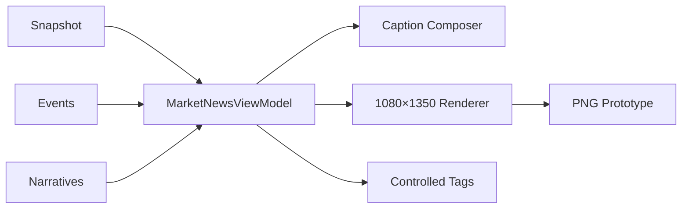

# Fiona Market News Image Intelligence

- Version: V2 Phase 2A
- Status: Prototype
- Owner: Fiona Product / Engineering
- Updated: 2026-07-24

## 1. 产品目标

Fiona Market News 从纯文字市场播报升级为一条 Telegram 消息中的智能图文情报卡片。

用户体验分为三层：

1. Layer 1 — Caption Summary：10 秒内理解市场状态、关键变化和 Fiona 判断。
2. Layer 2 — Image Intelligence：点击 1080×1350 PNG 查看完整市场结构。
3. Layer 3 — Tags：通过受控标签建立未来的主题检索与知识库入口。

本阶段只覆盖 Fiona Market News，不修改 Morning、Evening、Daily、Weekly 或 Alert。

## 2. 用户体验设计

Fiona 的视觉与内容人格是温暖、冷静、专业、克制。信息卡片参考 Bloomberg Terminal、Kaiko、Glassnode 和机构研究报告的阅读方式，但避免过度科技感、红绿赌博感、营销标题和任何交易暗示。

核心阅读顺序：

```text
Caption
  ↓
Market Heat Map
  ↓
What Changed
  ↓
Key Markets
  ↓
Current Narrative
  ↓
Fiona's View
```

## 3. 当前生产链路

```mermaid
flowchart LR
    Railway --> Runtime["app.fiona_runtime"]
    Runtime --> Scheduler["app.fiona_scheduler"]
    Scheduler --> Occurrence["Scheduled Occurrence"]
    Occurrence --> Snapshot["Wilson Snapshot"]
    Snapshot --> Events["Fiona Events / Narratives"]
    Events --> Brief["build_market_news_brief"]
    Brief --> Message["telegram_service.send_message"]
    Message --> Telegram["Telegram Bot API"]
```



当前事实：

- Market News 文字入口：`app.fiona_briefing.build_market_news_brief`
- Runtime 选择入口：`app.fiona_runtime.build_brief`
- 生产发送方式：`app.fiona_runtime.push_text` → `app.telegram_service.send_message`
- Fiona 定时链路当前不生成或发送图片。
- `app.wilson` 存在旧版 SVG、PNG 和 `sendDocument` 能力，但不属于当前 Fiona Scheduler 的图片链路。

## 4. Phase 2A 新链路

本阶段只创建原型，不接入生产：



关键原则：

- 图片不重新抓取数据。
- Caption 不重新计算数据。
- Caption、PNG 和 Tags 只读取同一份 `MarketNewsViewModel`。
- 原型模块不被 `fiona_runtime`、Scheduler 或 Telegram 生产发送引用。

## 5. ViewModel

`MarketNewsViewModel` 包含：

- `generated_at`
- `heat_map`
  - US
  - China
  - Crypto
  - RWA
- `key_markets`
  - BTC
  - ETH
  - S&P 500
  - HSI
  - RWA TVL
- `what_changed`
  - event
  - why
  - watch
- `current_narrative`
- `fiona_view`
- `tags`
- `data_quality`

缺失值使用明确的 `—`、`数据暂缺` 和 `Partial/Degraded` 状态，不伪造数值。

## 6. 图片规范

- Format: PNG
- Canvas: 1080×1350
- Ratio: 4:5
- Title: 42 px
- Section title: 17–19 px
- Body: 17–20 px
- Core metric: 25–39 px
- Maximum What Changed items: 3
- Maximum current narratives: 3
- Fiona's View 是底部最醒目的判断区域。

Phase 2A 使用标准库生成 SVG 布局，并在 macOS 原型环境使用 `sips` 转换为 PNG。SVG 生成逻辑可移植，但 `sips` 不存在于 Railway Linux，因此当前转换器不能直接用于生产。

生产 Renderer 建议：Phase 2B 使用 Pillow 直接输出 PNG，并随项目部署确定版本的 CJK 字体。该方案比 Playwright 更轻，且比依赖系统 SVG 转换器更容易保证 Railway 上的字体与像素一致性。引入前必须先做 Railway 构建验证。

## 7. Caption 规范

- Length: 120–350 Chinese characters
- 内容顺序：
  1. 市场状态
  2. 关键变化
  3. Fiona's View
  4. Hashtags
- 不复制完整文字报告。
- 不包含价格预测、投资建议或交易指令。
- 如果没有高价值变化，明确写“暂无新增高价值变化”。

## 8. Tag 规范

复用 `app.fiona_contracts.FionaTag` 与 `TagType`。

内部标签与 Telegram hashtag 分离：

| Internal Tag | Type | Telegram |
| --- | --- | --- |
| `asset_btc` | Asset | `#BTC` |
| `policy_federal_reserve` | Policy | `#Fed` |
| `narrative_liquidity` | Narrative | `#Liquidity` |
| `narrative_rwa` | Narrative | `#RWA` |

规则：

- 最多 8 个。
- canonical ID 和 hashtag 分别去重。
- 短英文标签使用词边界匹配，避免 `AI` 被 `China` 等词误触发。
- 不输出空泛、重复或无法用于检索的标签。

## 9. Telegram 方案

| Option | 清晰度 | 手机体验 | Caption | 文件大小 | 结论 |
| --- | --- | --- | --- | --- | --- |
| A. `sendPhoto + caption` | Telegram 可能压缩 | 最强，直接显示 | 支持 | 较小 | 适合轻量图片，不适合高密度情报卡 |
| B. `sendDocument + caption` | 保留原始 PNG | 需要点击查看完整图 | 支持 | 原始大小 | 推荐 |
| C. Media Group | 可包含多图 | 信息层级更复杂 | 支持但交互分散 | 多文件 | 单图场景没有必要 |

Phase 2B 推荐 `sendDocument + caption`。原因：

- 1080×1350 情报卡中的文字需要保留原始清晰度。
- 用户先阅读 Caption，再点击图片深读，符合 One Message, Three Layers。
- 当前原型约 0.55 MB，远低于 Telegram Bot API 的文件上限。
- Caption 目标为 120–350 字，低于 Bot API 目前对媒体 Caption 的 1024 字符限制。

参考：[Telegram Bot API](https://core.telegram.org/bots/api)。

当前 `telegram_service.send_document` 还不接收 Caption。Phase 2A 不修改该生产函数；生产接入时应增加向后兼容的可选 `caption` 参数。

## 10. Fallback

失败处理顺序：

```text
Build ViewModel
  ↓
Compose Caption
  ↓
Render PNG
  ├─ Success → sendDocument + caption
  └─ Failure → sendMessage(original Market News text)

sendDocument
  ├─ Success → complete
  └─ Failure → sendMessage(original Market News text)
```

图片失败不得阻断 Market News。生产接入时，原文字报告必须在渲染前保留，作为确定性回退内容。

## 11. 下一阶段建议

Phase 2B 只做生产桥接：

1. 选择并固定 Railway 可用的 PNG Renderer。
2. 为 `send_document` 增加可选 Caption，不改变现有调用。
3. 将图文模式限制为 Fiona Market News。
4. 增加 renderer/sendDocument 双重失败回退。
5. 先在 `WILSON_SEND=0` 和 Telegram mock 下验证。
6. Wilson 审核图片后再决定是否接入生产。
