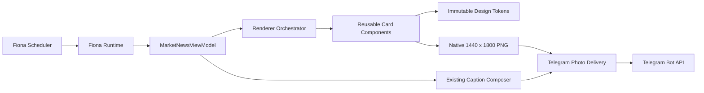
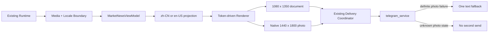
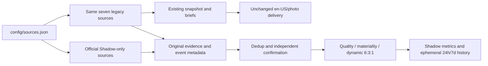
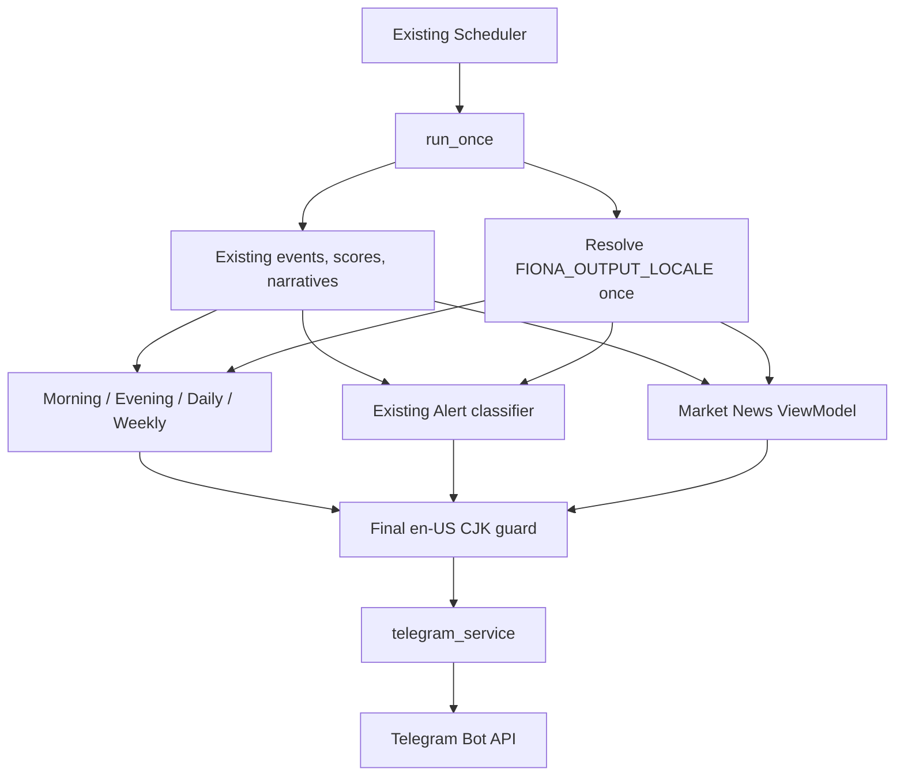

# Fiona Architecture Snapshot - Visual V3 / Design System 1.0

- Version: V3.0.0 Production base + V3.1-alpha.2 Shadow Candidate
- Status: Gate 1 CLOSED; Gate 2 implemented; global selection inactive
- Owner: Fiona Engineering
- Updated: 2026-09-03

## Production Pipeline

## V3.1-alpha.1 Optional Market News Profile

`FIONA_TELEGRAM_MEDIA_MODE` defaults to `document` and
`FIONA_OUTPUT_LOCALE` defaults to `zh-CN`. The alpha path reuses the existing
runtime, coordinator, delivery result, temporary-file lifecycle, and occurrence
arbitration. It does not introduce another scheduler, ledger, or sender.

The effective production settings are `photo + en-US`. Coverage and cadence
remain on their `legacy` defaults, and 4H Delta remains `off`.

## V3.1 Gate 2 Source and Coverage Boundary

Only Market News evaluates Shadow. Its result is not an input to the public
brief, renderer, caption, or Telegram sender. The synchronous evaluator uses
bounded feed sizes, timeouts, and a safe failure boundary. It writes no
scheduler ledger or occurrence. The history is not durable on Railway without
a Volume; no Volume is added in this gate. Existing five task times, photo
transport, language boundary, Alerts, and Delta remain unchanged.

## V3 Visual Change Boundary

V3 与 Design System 1.0 只替换 Renderer 内部的视觉表现和工程组织：布局、字体层级、色彩、间距、密度、品牌签名、tokens 与组件。Scheduler、Runtime、ViewModel contract、Caption Composer、Telegram Service、Railway command、ledger 与 arbitration 均未改变。

## V3.1 Gate 1.1 Language Boundary

Original source-language fields remain in events, snapshot data, memory, and
provenance. Locale projection occurs only after existing business decisions.
No score, route, alert threshold, schedule, ledger, or delivery transport is
changed. The final text boundary performs at most one deterministic repair and
one safe English fallback.

## Compatibility

- 输入仍为 `MarketNewsViewModel`。
- 输出仍为 RGB PNG；V3 基础 profile 为 1080×1350，生产 iOS photo profile 为直接渲染的 1440×1800，最大 1.5 MB。
- 缺失数据和长文本继续使用确定性规则。
- 生产 Feature Flag 与 fallback 行为不变。
- `app/fiona_card_renderer.py` 保留旧公开 helper 的兼容 wrapper。
- 组件只消费 ViewModel 派生输入、RenderContext 与 `FIONA_TOKENS`，不产生外部副作用。
- `FIONA_IOS_TOKENS` 是直接 1440 x 1800 渲染 profile，不是 1080 图像放大。
- `app/fiona_locale.py` 只负责输出边界、共享术语、确定性英文投影与语言验证，不承担评分或路由判断。
- Market News、Morning、Evening、Daily、Weekly 与 Alert 已接入同一 `en-US` 边界；Gate 1 生产验收完成。
- Gate 2 尚未开始，Global 6:3:1、Global 4H cadence 与 4H Delta 均未激活。
