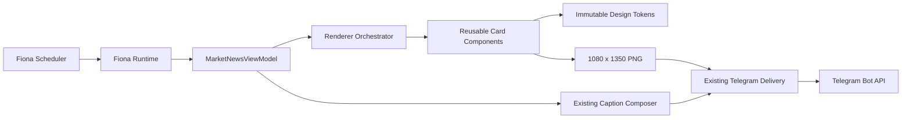
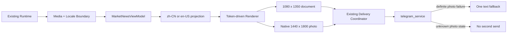

# Fiona Architecture Snapshot - Visual V3 / Design System 1.0

- Version: V3.0.0 Production / V3.1-alpha.1 optional profile
- Status: Production baseline plus legacy-safe alpha extension
- Owner: Fiona Engineering
- Updated: 2026-08-05

## Production Pipeline

## V3.1-alpha.1 Optional Market News Profile

`FIONA_TELEGRAM_MEDIA_MODE` defaults to `document` and
`FIONA_OUTPUT_LOCALE` defaults to `zh-CN`. The alpha path reuses the existing
runtime, coordinator, delivery result, temporary-file lifecycle, and occurrence
arbitration. It does not introduce another scheduler, ledger, or sender.

## Change Boundary

V3 与 Design System 1.0 只替换 Renderer 内部的视觉表现和工程组织：布局、字体层级、色彩、间距、密度、品牌签名、tokens 与组件。Scheduler、Runtime、ViewModel contract、Caption Composer、Telegram Service、Railway command、ledger 与 arbitration 均未改变。

## Compatibility

- 输入仍为 `MarketNewsViewModel`。
- 输出仍为 RGB PNG，1080×1350，最大 1.5 MB。
- 缺失数据和长文本继续使用确定性规则。
- 生产 Feature Flag 与 fallback 行为不变。
- `app/fiona_card_renderer.py` 保留旧公开 helper 的兼容 wrapper。
- 组件只消费 ViewModel 派生输入、RenderContext 与 `FIONA_TOKENS`，不产生外部副作用。
- `FIONA_IOS_TOKENS` 是直接 1440 x 1800 渲染 profile，不是 1080 图像放大。
- `app/fiona_locale.py` 只负责输出边界和确定性语言资源，不承担业务判断。
- Market News `en-US` 已接入；Morning、Evening、Daily、Weekly 与 Alert 的语言迁移仍待后续独立评审。
