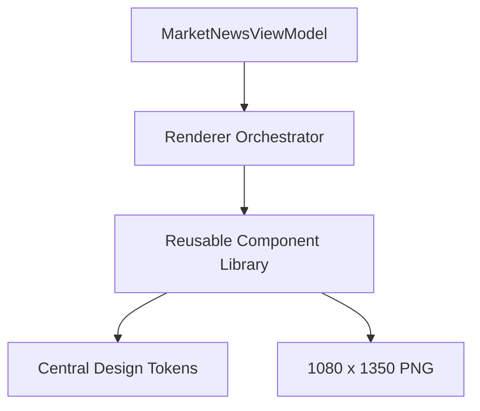

# Fiona Design System 1.0

- Version: V3.0.0 / Design System 1.0
- Status: Production
- Owner: Wilson / Fiona Design Engineering
- Updated: 2026-08-05

## 1. Purpose

Fiona Design System 1.0 是所有 Intelligence Card 的长期视觉基础。它不改变业务数据、调度或发送方式，只统一视觉语言、组件边界和渲染约束。

核心顺序：

1. Judgement first
2. Evidence second
3. Data third

## 2. Product Contract

- 3 秒：理解 Today's Judgement 与 Market Regime。
- 10 秒：理解 Primary Driver、Next Confirmation 与 Evidence。
- 30 秒：完成 Heat Map、变化、市场、叙事和历史语境阅读。
- 图片是完整产品；Caption 只做摘要，不复述图片。
- 不提供交易信号、价格预测或行动建议。

## 3. System Layers

## 4. Foundations

- Canvas: 1080 x 1350, RGB PNG, maximum 1.5 MB.
- Typography: bundled Noto Sans CJK, fixed semantic scale, no viewport scaling.
- Color: restrained terminal surfaces with semantic positive, negative, neutral and unknown states.
- Spacing: tokenized rhythm; component content is clipped before typography is reduced.
- Brand: `FIONA INTELLIGENCE` and `AI MARKET INTELLIGENCE` as a low-contrast signature.

## 5. Components

Header, Market Regime, Evidence, Hero Judgment, Heat Map, What Changed, Key Markets, Narrative, Watch Next, Historical Context, Brand Signature and Footer.

Each component has typed input, a deterministic render result, an independent region and isolated tests.

## 6. Compatibility Boundary

Unchanged:

- Scheduler and occurrence timing
- Runtime orchestration
- Telegram delivery and API calls
- Railway configuration and variables
- MarketNewsViewModel public contract
- Ledger and arbitration

## 7. Acceptance

- Full, Missing and Stress prototypes render without overlap.
- Missing values remain visibly unknown rather than becoming zero.
- Long text is semantically truncated and never shrinks the type scale.
- Renderer contains no duplicated raw color or typography constants.
- Production validation performs zero Telegram calls and zero ledger mutations.
