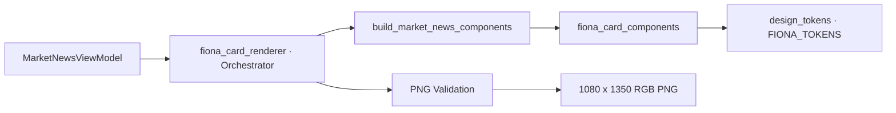
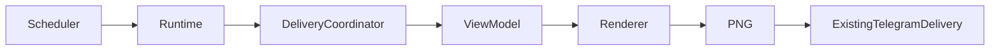

# Fiona Renderer Architecture

- Version: V3.0.0 / Design System 1.0
- Status: Production
- Owner: Wilson / Fiona Design Engineering
- Updated: 2026-08-05

## Architecture

## Responsibilities

### `app/design_tokens.py`

定义不可变视觉基础。不得依赖 ViewModel、Runtime 或 Telegram。

### `app/fiona_card_components.py`

定义组件输入、布局、文本处理和组件绘制。组件不得产生外部副作用。

### `app/fiona_card_renderer.py`

将 ViewModel 转换为组件序列，创建 Pillow canvas，执行组件并验证输出。保留旧公开 helper 作为 backward-compatible wrapper。

## Production Boundary

本阶段只修改 Renderer 内部。Scheduler、Runtime、DeliveryCoordinator、Telegram Service、Railway command、feature flags、ledger 与 arbitration 均不变。

## Failure Contract

- Renderer 输入不足时产生 Unknown/Limited，不生成虚构值。
- 长文本截断不能改变字号。
- PNG 必须满足尺寸、颜色模式和文件大小限制。
- 生产 fallback 仍由现有 delivery layer 负责。
