# Fiona Global Coverage Engine 6:3:1

- Version: V3.1-alpha.2
- Status: Implemented / Shadow Candidate
- Owner: Fiona Engineering
- Updated: 2026-09-03

## 1. Product Rule

The long-run editorial target is US & Europe 60%, Greater China 30%, and Rest of
World 10%. This is a dynamic weighting target, not a hard quota. A material
event is never suppressed merely because its region is already represented.

## 2. Architecture

```mermaid
flowchart LR
    Registry[Canonical Source Registry] --> Collectors[Bounded Public Collectors]
    Collectors --> Provenance[Original Provenance]
    Provenance --> Normalize[Deterministic Normalization]
    Normalize --> Region[Event Region]
    Region --> Cluster[Dedup + Event Clustering]
    Cluster --> Materiality[Materiality + Quality Floor]
    Materiality --> Rank[Dynamic 6:3:1 Ranking]
    Rank --> Shadow[Shadow Selection + Metrics]
    Legacy[Legacy Selection] --> Telegram[Existing Telegram Content]
    Shadow -. no content mutation .-> Observability[24H / 7D Observability]
```



## 3. Canonical Regions

- `US_EU`
- `GREATER_CHINA`: Mainland China, Hong Kong, and Taiwan
- `REST_OF_WORLD`
- `GLOBAL`
- `UNKNOWN`

The event determines region. A global publisher covering BOJ is ROW; a U.S.
publisher covering PBOC is Greater China. Singapore is not Greater China.

## 4. Event and Provenance Contract

`NormalizedCoverageEvent` preserves source ID/name/URL, original language,
original title/snippet, published and retrieved timestamps, publisher region,
event region, source tier, and independence group. Stable IDs are SHA-256 based
and deterministic; an LLM is not used for identity, region, clustering, score,
or routing.

## 5. Clustering and Deduplication

The bounded algorithm uses canonical URL, source identity, independence group,
category, time distance, entities, and normalized token similarity. It handles:

- exact URL duplicates;
- same-source repeats;
- syndicated repeats;
- near-duplicate headlines;
- independent confirmation of one underlying event.

Duplicate articles remain auditable in a cluster but do not inflate independent
confirmation. Cluster IDs are deterministic for the same event set and stable
across input ordering. No embeddings, vector database, or PostgreSQL are used.

Except for an exact article URL, matches require publication proximity within
36 hours. Annual releases with identical titles and distinct URLs remain
separate. Missing article links stay empty, not the shared feed URL. Identical
substantial snippets across publishers count as syndication; owner, article URL,
and copy identity are unioned before counting independent evidence. These are
conservative heuristics, not proof of independent reporting.

## 6. Freshness and Materiality

Freshness uses `published_at` separately from `retrieved_at`. Initial windows
are 96h for macro/regulation, 72h for RWA, 48h for market/other, and 36h for
crypto. Invalid or absent timestamps remain `unknown` and are not selected as
current intelligence.

Materiality is deterministic and bounded 0-100. It combines source tier,
policy/regulatory/systemic terms, surprise/deviation language, market breadth,
and cross-market impact. It does not use random values or publisher popularity.
Only explicit systemic phrases or a score of at least 85 qualify for a material
override.

The initial numeric model is heuristic, not calibrated market-impact data:
tier contributes 24/17/12 (unknown 5); exceptional terms add 50, material policy
terms add 31, other macro/regulation adds 23, market/crypto/RWA adds 15.
Surprise language adds 10. Cross-market breadth starts at 20 and adds 24 per
extra inferred market (macro/regulation minimum 58), capped at 100; 12% enters
materiality. Cluster independence adds at most 12 points. Quality adds tier
authority (12/7/3) and independent evidence (6 per extra group, capped at 12),
then caps at 100. Narrative relevance is a category prior (65 or 48), not a
claim that narrative strength was independently measured.

## 7. Ranking

Initial base score:

```text
46% materiality
13% cross-market impact
15% freshness
10% source-tier authority
 8% independent confirmation
 8% narrative relevance
```

A soft regional-deficit adjustment is then applied during deterministic greedy
selection. Equal-quality, sufficiently deep candidate pools converge near
6:3:1. Better events can override the target. A cluster must pass the quality
floor (`40`) and freshness checks. Missing qualified regional events remain
underweight and receive an explicit `regional_gap_reason`.

## 8. Shadow Isolation

`FIONA_COVERAGE_PROFILE` accepts `legacy` and `global_631`; invalid values warn
and resolve to `legacy`. During Gate 2, legacy remains the only selection
authority even while the Shadow evaluator runs. It does not alter briefs,
Telegram, delivery mode, occurrences, Alert behavior, scheduler cadence,
arbitration, or the scheduler ledger.

Per-evaluation metrics include candidate/qualified/selected counts, regional
and tier distributions, unknown share, source/independence diversity, duplicate,
syndication and stale rejection, material overrides, coverage gaps, and
confirmation distribution.

## 9. Persistence and Observation

Shadow history retains 21 days locally and exposes rolling 24h/7d summaries.
On Railway without a Volume, this JSON file is **ephemeral**, not durable memory.
Structured deployment logs are therefore required evidence during alpha. No
Railway Volume is introduced in Gate 2.

Activation requires at least 14 days of Shadow observation and 100 qualified
clusters, plus reviewer checks for false positives, missed material events,
source health, regional quality, and licensing/access. A single edition cannot
prove 6:3:1 compliance.

## 10. Safe Validation

```bash
python3 -m app.fiona_runtime validate-source-registry
python3 -m app.fiona_runtime validate-global-coverage
```

The coverage validator fetches public candidates, normalizes, clusters, and
ranks in memory. It reports `telegram_api_calls=0`, `ledger_mutations=0`, and
`formal_occurrences_created=0`.

## 11. Operational Boundaries

Market News calls the safe Shadow evaluator synchronously after generating its
legacy payload. Expanded adapters use six workers, a 12-second socket timeout,
4 MiB response cap and 50 normalized items per source. Socket timeout is not a
hard whole-evaluation deadline; slow streaming/DNS and clustering remain latency
risks to monitor. No retry storm or additional user-facing occurrence is added.
Missing JSON paths and non-feed XML are classified as invalid responses, not
empty news. TLS validation and access restrictions are never bypassed.

The observation count deduplicates overlapping cluster event IDs across runs.
Rolling regional shares are edition-weighted; source diversity is explicitly an
average of per-evaluation diversity. Stored history contains metrics, safe
source health and hashed event membership, not headlines or article bodies.
Neither local validators nor mock runs establish production observation start.
