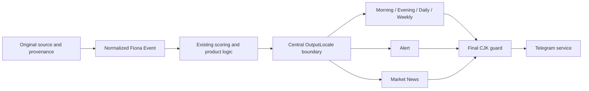

# Fiona User-Visible Surface Matrix

- Version: V3.1-alpha.1.1
- Status: Production Validated; Gate 1 CLOSED
- Owner: Fiona Engineering
- Updated: 2026-09-03

## Production Surface Inventory

| Surface | Production path | Template source | Text type | Locale before Gate 1.1 | Gate 1.1 result |
|---|---|---|---|---|---|
| Market News card | Runtime -> ViewModel -> renderer -> photo | `fiona_locale` + card components | Deterministic | en-US | Preserved |
| Market News caption | Runtime -> delivery coordinator -> photo caption | `fiona_market_news_image` + `fiona_locale` | Deterministic | en-US | Preserved |
| Market News text fallback | Delivery coordinator -> `push_text` | localized ViewModel | Deterministic | en-US | Preserved and final-guarded |
| Morning | Runtime -> brief builder -> `push_text` | `fiona_briefing` | Deterministic synthesis | zh-CN/mixed | Migrated |
| Evening | Runtime -> brief builder -> `push_text` | `fiona_briefing` | Deterministic synthesis | zh-CN/mixed | Migrated |
| Daily | Runtime -> brief builder -> `push_text` | `fiona_briefing` | Deterministic synthesis | zh-CN/mixed | Migrated |
| Weekly | Runtime -> brief builder -> `push_text` | `fiona_briefing` | Deterministic synthesis | zh-CN/mixed | Migrated |
| Alert | Runtime -> classifier -> `push_text` | `fiona_classifier` | Deterministic synthesis | zh-CN/mixed | Migrated |
| Standalone Alert runtime | Alert runtime -> classifier -> Telegram service | `fiona_classifier` | Deterministic synthesis | zh-CN/mixed | Migrated |
| Missing-data copy | Per-brief builders | centralized resources | Deterministic | zh-CN/mixed | Migrated |
| Error-safe fallback | Runtime exception boundary -> `push_text` | `fiona_locale` | Deterministic | Market News only | Extended to all briefs |
| Fiona's View | Per-brief presentation layer | category/narrative rules | Deterministic | zh-CN | Migrated |
| Watch / Confirmation | Per-brief presentation layer | category-aware rules | Deterministic | zh-CN | Migrated |
| Narrative names | Brief presentation layer | canonical narrative map | Deterministic | mixed | Migrated |
| Date and time | Final user surface | `fiona_locale` | Deterministic | mixed | Standardized |
| Disclaimer | Final user surface | `fiona_locale` | Deterministic | mixed | Standardized |
| Hashtags | Market News caption only | existing caption composer | Deterministic | en-US-safe | Preserved |

## Locale Boundary

## Production-Reachable Legacy Code

`app/fiona_runtime.py` is the production scheduler bridge. Its active brief
builders and Alert renderer now receive the resolved locale. Legacy analytical
helpers elsewhere in `app/` may contain Chinese copy, but they do not reach the
current Fiona Telegram runtime unless routed through this boundary.

Historical Markdown, generated reports, test fixtures, and source-provenance
fields are not treated as user-surface leakage. They remain available for
auditability.

## Generated Text Policy

The current active surfaces are deterministic and do not invoke an LLM. Future
model-generated copy must explicitly request American English, preserve facts
outside the model response, and pass the same final CJK guard. An LLM may not
independently verify a source, infer an unsupported cause, or bypass fallback.
