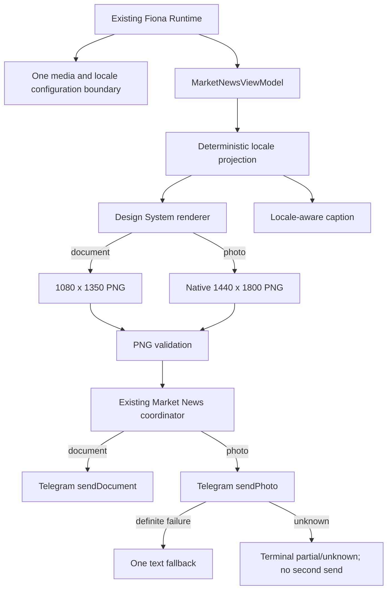

# Fiona V3.1 Gate 1 Implementation

- Internal version: V3.1-alpha.1
- Gate: Native Telegram Photo + `en-US`
- Status: PASS WITH CONDITIONS
- Owner: Wilson / Fiona Engineering
- Updated: 2026-08-25
- Production baseline: V3.0.0

## Previous Wave Retrospective

Gate 0 established the verified V3.0.0 baseline, audited V3.1 feasibility, and
froze product, delivery, language, coverage, cadence, and persistence decisions.
It changed documentation only and closed with `PASS WITH CONDITIONS` at commit
`fd012c8`. The principal deferred risks were production-safe `sendPhoto`,
deterministic American English, incomplete source provenance, insufficient
global source coverage, scheduler profile migration, and non-durable Railway
state. Gate 1 addresses only the first two risks. The V3.0.0 production
schedule, sources, ledger, arbitration, Alert behavior, and Railway variables
remain unchanged.

Gate 0 genuinely passed: repository identity, product freeze, technical audit,
206-test baseline, and no-production-impact evidence agree with its closeout.

## Objective

Provide a reversible native Telegram photo transport and a centralized
American-English output boundary for Market News without activating either
capability in production.

## Implemented Scope

- `sendPhoto` multipart upload with caption, optional parse mode, classified
  definite/unknown outcomes, sanitized errors, and `message_id` extraction.
- `FIONA_TELEGRAM_MEDIA_MODE=document|photo`, default `document`.
- `FIONA_OUTPUT_LOCALE=zh-CN|en-US`, default `zh-CN`.
- Native 1440 x 1800 Pillow profile using Design System 1.0 components and
  tokens; no 1080 x 1350 upscale path.
- iOS-safe margins, direct RGB PNG validation, maximum 1.5 MB product boundary,
  and deterministic temporary-file cleanup.
- Centralized Market News labels, date/time, missing-data language,
  disclaimer, caption terminology, and CJK leakage guard.
- A short 180-450 character English caption in which the image remains the
  primary artifact.
- Original event source fields preserved in a provenance sidecar where the
  current normalized event contains them.
- Production-safe validator for `photo + en-US` with zero Telegram calls and
  zero scheduler-ledger mutations.

## Explicit Non-Scope

- Global source expansion, source ranking, or 6:3:1 allocation.
- Six-slot scheduling, 4H terminology, 4H Delta, or Railway Volume.
- Morning, Evening, Daily, Weekly, or Alert product redesign.
- External translation provider or LLM translation layer.
- Railway variable changes or Telegram production activation.

## Runtime Architecture



No second ledger or idempotency system was introduced.

## Existing Telegram Audit

| Concern | Before Gate 1 | Gate 1 result |
|---|---|---|
| Document + caption | Production path | Preserved |
| Photo + caption | Missing production contract | Implemented |
| Parse mode | Not available on photo helper | Optional and explicit |
| Timeout/network | Classified by delivery service | Photo returns unknown |
| Photo HTTP 4xx/API rejection | Incomplete | Definite failure |
| Photo HTTP 5xx | Incomplete | Unknown delivery |
| Malformed response | Incomplete | Unknown delivery |
| Message ID | Raw response only | Coordinator validates/extracts |
| Credential logging | Sanitized in existing paths | Photo path also sanitized |
| File lifecycle | Multipart context manager | Explicitly tested for photo |

## Feature Flags

| Flag | Valid values | Default | Invalid value |
|---|---|---|---|
| `FIONA_TELEGRAM_MEDIA_MODE` | `document`, `photo` | `document` | warn + `document` |
| `FIONA_OUTPUT_LOCALE` | `zh-CN`, `en-US` | `zh-CN` | warn + `zh-CN` |

Values are whitespace-trimmed and case-insensitive. Runtime reads each flag once
at the Market News configuration boundary. The media flag changes transport and
render profile only; it does not change source coverage, cadence, or ViewModel
business inputs.

## Delivery Matrix

| Condition | Terminal behavior |
|---|---|
| Document success | One document |
| Document definite failure | Existing text fallback |
| Photo success | One photo; no text |
| Photo definite failure | One text fallback; no document |
| Photo unknown | Partial/unknown; no retry and no fallback |
| Renderer failure | One text fallback |
| Caption failure | One safe text fallback |
| PNG validation failure | One text fallback |
| Text fallback failure | Existing runtime failure semantics |

## Language Boundary

```text
Original source
  -> current event normalization
  -> deterministic Market News intelligence projection
  -> centralized en-US labels and formatting
  -> user-visible CJK validation
```

Market News card, caption, text fallback, missing states, timestamp, judgment,
and disclaimer support `en-US`. There is no active model prompt in this Market
News projection, so no model-prompt language change was required.

Morning, Evening, Daily, Weekly, and Alert still contain Chinese deterministic
labels and narrative copy. They were deliberately not migrated because doing so
would expand Gate 1 into five product rewrites. The locale module is reusable by
those products, but V3.1-alpha.1 must not be described as system-wide English.

## Source Provenance

`MarketNewsViewModel.source_provenance` retains source name, URL, language,
original title, and original text when those fields exist on the normalized
event. Current upstream events do not consistently carry source URLs or fully
separate original title/snippet fields. Gate 1 preserves available information
but does not invent missing provenance or add a provider.

## Observability

The coordinator records media mode, output locale, render status/dimensions,
PNG bytes, caption length, photo/document status, fallback reason, final
channel, delivery state, cleanup state, and sanitized error category. It does
not log Bot Token, Chat ID, full caption, credentials, or full source payload.

## Validation Evidence

- Compile: PASS.
- Full unit suite: 234 tests PASS after final Gate 1 test sync.
- Four feature-flag combinations: covered.
- Native Full/Missing/Stress renders: covered.
- Renderer resize interception: no upscale path.
- Local Telegram API calls: 0.
- Scheduler ledger mutations in validator: 0.
- Prototype output: `reports/prototypes/fiona_v3_1_gate1/` (excluded from Git).

## Production Impact

The release is safe to deploy behind legacy defaults. It does not change
Scheduler, cadence, ledger, arbitration, source coverage, Alerts, other briefs,
Railway command, or production variables. Until Product Review explicitly
changes variables, production remains `document + zh-CN`.

## Known Risks and Technical Debt

1. Real iOS Telegram-client processing has not been tested in this local gate.
2. Morning, Evening, Daily, Weekly, and Alert have not migrated to `en-US`.
3. Upstream provenance is incomplete; Gate 2 must address source identity before
   claiming global evidence coverage.
4. English event projection is deterministic and deliberately conservative; it
   withholds unsupported detail instead of translating arbitrary source prose.
5. Production activation and Railway observation require a separate Product
   Review and variable cutover.

## Rollback

Set `FIONA_TELEGRAM_MEDIA_MODE=document` and
`FIONA_OUTPUT_LOCALE=zh-CN`. Both are already the code defaults. No Scheduler,
ledger, data, or schema rollback is required.

## Wave Completion Review

- Objective met: Yes, within Market News.
- User-visible production behavior changed by default: No.
- Scope respected: Yes.
- Tests and validator: PASS.
- Prototype and automated iOS preview: PASS.
- Real-device iOS Telegram QA: Pending.
- System-wide `en-US`: Not claimed; remaining surfaces documented.
- Production safety blocker: None while legacy defaults remain active.

**Gate verdict: PASS WITH CONDITIONS.**

Conditions: complete isolated Telegram/iOS review before photo activation and
migrate remaining brief surfaces through a separately reviewed language wave.
Gate 2 is not started.
