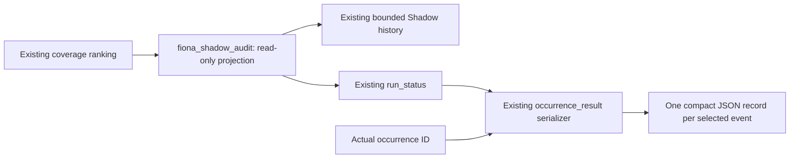

# Gate 2.1 - Shadow Editorial Observability

- Internal version: V3.1-alpha.2 / Gate 2.1
- Owner: Wilson / Fiona Engineering
- Date: 2026-09-05
- Status: Local validation passed; production detailed-event acceptance pending
- Parent Gate 2: PASS WITH CONDITIONS; Gate 3: LOCKED

## Previous Production Evidence

Gate 2 commit `6ae7f6d41561d35510830e4199f4af6449c7e0f1` deployed as
`391edfa2-5f88-4774-83da-8acec79f1b72`. The September 4 and September 5
midnight Market News occurrences completed successfully with legacy-selected
native Photo/en-US delivery. Shadow selected 10 clusters each time, from 87
and 85 qualified clusters. The deduplicated historical cumulative count is 159.

The official observation start remains **2026-09-04 00:02:09.964920 UTC+8**.
The 100-cluster condition is satisfied; the 14-day condition is pending.
Adding editorial detail does not restart that clock. Post-patch editorial
review starts at the first natural post-patch Market News occurrence.

## Root Cause

`CoverageEvaluation.selected_clusters` already contains rank order, headlines,
provenance and scores. `run_global_coverage_shadow` previously returned only
aggregate metrics. `CoverageObservationStore.record` saved metrics, source
health and qualified membership IDs, not selected headlines. Historical
aggregates remain valid, but historical headline reviews cannot be recreated
from them. Freshly fetched stories must never stand in for a historical run.

## Architecture and Release Boundary

New production module: `app/fiona_shadow_audit.py`.
`app/fiona_coverage_runtime.py` adds projection fields to its existing result,
validator and history. `app/fiona_runtime.py` adds an import and a logging hook
only in the result serializer. Scheduler decisions, execution, ledger writes,
ranking, collectors, source registry, flags, Telegram, Alerts and cadence are
unchanged. No database, volume, model call or second observation store is added.

## Audit Contract

| Fields | Meaning |
|---|---|
| evaluation_id, evaluated_at | Deterministic identity from evaluation time and ordered selected IDs |
| occurrence_id | Actual ID in compact production logs; null in a standalone validation or pre-serializer record |
| rank, cluster_id, normalized_headline | Existing selection order, stable cluster identity, sanitized headline (maximum 240 characters) |
| event_region | Existing inferred event region |
| source_ids, source_count, source_tier, source_tiers | Existing source identities, count and authority tiers |
| source_composition | Source-to-tier and source-to-independence-group mapping |
| independent_source_count, independence_groups | Existing corroboration count and publisher grouping; group count does NOT replace corroboration count |
| materiality, freshness | Existing materiality, freshness score and stale flag; no invented age or timestamp |
| material_override, override_reason | Existing override decision; reason null when not applicable |
| selection_reason | Deterministic signal labels, never generated by an LLM |
| score_components | Existing raw dimensions, quality, base score, final score and derived adjustment |
| regional_target_context | Existing target, earlier selected count and earlier regional share |
| ranking_changed | Whether projection changed selected IDs/order; fixed pre-patch baselines independently verify full equivalence |
| audit_records_omitted, identities_truncated | Explicit volume-limit disclosure, never a ranking limit |

Compact stdout event name: `fionaShadowSelectedEvent`. Each record carries the
actual occurrence ID and evaluation ID, allowing Railway filtering without
reconstructing reordered multiline JSON. A pre-serializer history record has
`occurrence_id=null`; do not infer a task ID from the current date because
catch-up occurrences may belong to another date.

## Explanation and Score Semantics

Reasons expose quality-floor qualification, existing materiality/freshness/
cross-market ranking, Tier 1 authority, independent confirmation when count
exceeds one, a positive regional adjustment, and existing material overrides.
These are supporting selection signals, not counterfactual causal claims.

Score components preserve materiality, cross-market impact, freshness,
source tier, independent count, narrative relevance, quality score,
`base_ranking_score`, and final `ranking_score`. The difference between base
and final score is labeled regional adjustment or material override as
appropriate. No weights or thresholds were added to the ranking engine.

## Safety and Volume

Only selected events receive detail, normally 10 per evaluation. The audit
ceiling is 50 detailed records for exceptional override-heavy evaluations;
omissions are counted and selection is untouched. Source/group lists are
bounded with explicit truncation. Article bodies, snippets, URLs, payloads and
credentials are excluded through a field allowlist. Free text is normalized,
bounded and common secret formats/credential assignments are redacted.
The output uses no source-generated explanation text beyond the headline.
Logging failures cannot change delivery results or ledger status.

Existing aggregate metric names and values are preserved. Records extend the
same 21-day observation file. Old records load without migration or backfill.
The file remains ephemeral on Railway without a Volume; it is not described
as durable. For this controlled deployment, back up and restore only the
existing Shadow observation file and verify its hash, first timestamp and
cumulative cluster count. Never restore the scheduler ledger or Telegram state.
If preserving this history cannot be verified, stop the cutover and report.

## HKMA and Independence Watch

HKMA: **WATCH**. September 4 returned 100 items (50 normalized); September 5
timed out after about 12.7 seconds with zero returned items. Timeout settings,
adapter behavior, latency fields and item counting are unchanged.

The last production confirmation distribution had one independent source per
cluster. Detailed source composition will help distinguish expected official
single-source reporting from overly strict clustering. No semantic clustering
fix is included. Publisher independence groups may outnumber independent
confirmations when reports are syndicated or have the same canonical URL.

## Validation

- 22 focused tests cover required fields, rank, overrides, source composition,
  independence, deterministic reasons, unchanged scores, redaction, bounded
  output, actual occurrence correlation, logging failures and history continuity.
- Four fixtures captured before edits at `6ae7f6d`: balanced, material override,
  shared-headline reporting and empty input. Ordered cluster IDs and all aggregate
  metric digests match exactly after the patch.
- Full suite: 381 tests passed. Compile check passed.
- Fixed-source validator exposes audit records with no external network,
  Telegram calls, ledger mutations or formal occurrences; ranking_changed=false.
- Existing tests continue to check identical legacy payload bytes.

## Production Acceptance and Remaining Work

Precise commit: `Add Fiona Shadow editorial observability`; normal push only.
No flag changes. Verify the correct deployment SHA, one running instance,
healthy scheduler cycles and legacy coverage. Preserve photo/en-US and existing
cadence/Delta behavior. Use the next natural Market News, never synthetic
Telegram traffic. Confirm `fionaShadowSelectedEvent` records contain actual
occurrence IDs, ordered ranks, headlines, provenance and score signals, alongside
successful legacy-selected delivery and zero Shadow side effects.

First detailed production record: **PENDING natural occurrence**.
Gate 2 remains PASS WITH CONDITIONS and cannot close on cluster count alone.
Next work is editorial review of those records, not Gate 3.
